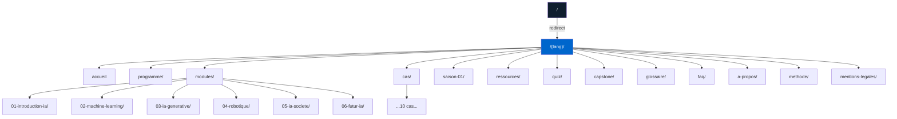
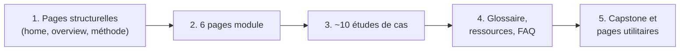

# Sitemap — AI Strategy

> Arborescence complète et plan d'URL du site, sur les **3 langues** (FR principal, EN, AR avec RTL).
> Cohérent avec ADR-006 (architecture multilingue par sous-dossiers symétriques) et le planning de Phase 4.

| Métadonnée | Valeur |
| :--- | :--- |
| **Version** | 1.0 |
| **Phase** | 2 — Architecture et design system |
| **Statut** | Ratifié — sert de référence à la Phase 4 |
| **Total pages publiées** | 26 par langue × 3 langues = **78 pages** |

---

## 1. Schéma global de l'arborescence



---

## 2. Convention d'URL

### 2.1 Structure générique

```
https://<domaine>/<lang>/<section>/<slug>/
```

Avec :

- `<lang>` ∈ `{fr, en, ar}`
- `<section>` ∈ `{programme, modules, cas, saison-01, ressources, quiz, capstone, glossaire, faq, a-propos, methode, mentions-legales}`
- `<slug>` en kebab-case, sans accents, sans articles superflus
- `<slug>` est **commun aux 3 langues** lorsque le contenu correspond (ex. `/fr/cas/morgan-stanley-genai/` ↔ `/en/cas/morgan-stanley-genai/`) pour faciliter le maillage `hreflang` et la maintenance.

### 2.2 Règles spécifiques

| Règle | Application |
| :--- | :--- |
| Trailing slash | Présent systématiquement (`/programme/`, pas `/programme`) |
| Casse | Toujours minuscule |
| Accents et caractères spéciaux | Translittérés ou supprimés (`générative` → `generative`) |
| Articles | Supprimés sauf si critique pour le sens (`l-ia` plutôt que `ia`, mais `futur-ia` plutôt que `le-futur-de-l-ia`) |
| Numérotation modules | Préfixe à 2 chiffres (`01-`, `02-`…) pour ordre alphabétique stable |
| Cas d'études | Slug `<entreprise>-<technologie>` (ex. `morgan-stanley-genai`, `stripe-radar-ml`) |
| Maximum 5 niveaux | `/lang/section/sous-section/slug/` (pas plus profond) |

### 2.3 Page racine et redirection

| URL | Comportement |
| :--- | :--- |
| `/` | Détection langue navigateur via `Accept-Language` → redirection 302 vers `/<lang>/` correspondant. Fallback `/fr/` si langue non supportée. Implémentation : `.htaccess` OVH côté serveur, ou JS minimal côté client en fallback. |
| `/<lang>/` | Page d'accueil de la langue. |
| `/sitemap.xml` | Sitemap d'index pointant vers les 3 sitemaps par langue. |
| `/robots.txt` | Autorisation complète, référence du sitemap d'index. |

---

## 3. Arborescence détaillée par langue

L'arborescence ci-dessous est **strictement identique** sur `/fr/`, `/en/`, `/ar/`. Les exemples utilisent `/fr/` à titre illustratif.

### 3.1 Pages éditoriales principales (Phase 4)

| URL | Titre indicatif (FR) | Type | Source de contenu MDX |
| :--- | :--- | :--- | :--- |
| `/fr/` | Accueil | Page d'accueil | `src/content/fr/home.mdx` |
| `/fr/programme/` | Vue d'ensemble du programme | Overview | `src/content/fr/overview.mdx` |
| `/fr/modules/` | Tous les modules | Index modules | `src/content/fr/modules/index.mdx` |
| `/fr/modules/01-introduction-ia/` | Module 1 — Introduction à l'IA | Module | `src/content/fr/modules/01-introduction-ia.mdx` |
| `/fr/modules/02-machine-learning/` | Module 2 — Machine Learning en entreprise | Module | `src/content/fr/modules/02-machine-learning.mdx` |
| `/fr/modules/03-ia-generative/` | Module 3 — IA Générative en entreprise | Module | `src/content/fr/modules/03-ia-generative.mdx` |
| `/fr/modules/04-robotique/` | Module 4 — Robotique en entreprise | Module | `src/content/fr/modules/04-robotique.mdx` |
| `/fr/modules/05-ia-societe/` | Module 5 — IA dans l'entreprise et la société | Module | `src/content/fr/modules/05-ia-societe.mdx` |
| `/fr/modules/06-futur-ia/` | Module 6 — Futur de l'IA | Module | `src/content/fr/modules/06-futur-ia.mdx` |

### 3.2 Études de cas (Phase 4)

| URL | Titre indicatif (FR) | Module(s) lié(s) |
| :--- | :--- | :--- |
| `/fr/cas/` | Toutes les études de cas | (Index avec filtres) |
| `/fr/cas/morgan-stanley-genai/` | Morgan Stanley — IA générative pour la recherche financière | M3, M5 |
| `/fr/cas/stripe-radar-ml/` | Stripe Radar — Machine Learning pour la détection de fraude | M2 |
| `/fr/cas/github-copilot-accenture/` | GitHub Copilot et Accenture — Productivité des développeurs | M3, M5 |
| `/fr/cas/amazon-robotics/` | Amazon Robotics — DeepFleet et IA dans la logistique | M4 |
| `/fr/cas/klarna-ai-assistant/` | Klarna — Assistant IA pour le service client | M3 |
| `/fr/cas/takeda-superminds/` | Takeda × MIT CCI — Intelligence collective augmentée | M1, M6 |
| `/fr/cas/sante-depistage/` | IA et santé — Dépistage et diagnostic assisté | M2, M5 |
| `/fr/cas/spotify-personalisation/` | Spotify — Personnalisation par ML (cas complémentaire) | M2 |
| `/fr/cas/gouvernance-nist-rmf/` | NIST AI RMF — Cas de gouvernance applicable | M5 |
| `/fr/cas/ocde-ai-act/` | OCDE et AI Act — Cadre réglementaire européen | M5 |

### 3.3 Saison 1 du podcast (Phase 6)

| URL | Titre indicatif (FR) | Acte |
| :--- | :--- | :--- |
| `/fr/saison-01/` | Saison 1 — Vue d'ensemble | (Index) |
| `/fr/saison-01/episode-01/` | E01 — Pourquoi l'IA change la stratégie | I — Comprendre |
| `/fr/saison-01/episode-02/` | E02 — Décrypter les familles d'IA | I — Comprendre |
| `/fr/saison-01/episode-03/` | E03 — Machine Learning dans la décision | II — Décider |
| `/fr/saison-01/episode-04/` | E04 — IA générative au travail | II — Décider |
| `/fr/saison-01/episode-05/` | E05 — Robotique et automatisation | II — Décider |
| `/fr/saison-01/episode-06/` | E06 — Choisir et lancer un pilote IA | III — Déployer |
| `/fr/saison-01/episode-07/` | E07 — Mesurer le ROI, gérer le risque | III — Déployer |
| `/fr/saison-01/episode-08/` | E08 — Gouvernance, éthique, conformité | IV — Gouverner |
| `/fr/saison-01/episode-09/` | E09 — IA, travail et compétences | IV — Gouverner |
| `/fr/saison-01/episode-10/` | E10 — Construire votre roadmap IA | V — Anticiper |

### 3.4 Pages transversales (Phases 4 & 5)

| URL | Titre indicatif (FR) | Description |
| :--- | :--- | :--- |
| `/fr/ressources/` | Ressources pédagogiques | Index avec filtres : module, type, secteur, niveau |
| `/fr/ressources/fiches/` | Fiches PDF téléchargeables | Sous-section avec ~30 PDFs |
| `/fr/ressources/lectures/` | Lectures recommandées | Bibliographie sourcée |
| `/fr/ressources/videos/` | Vidéos curées | Embeds YouTube + contexte |
| `/fr/ressources/standards/` | Standards et frameworks | NIST RMF, OCDE, AI Act, etc. |
| `/fr/quiz/` | Tous les quiz | Index avec progression |
| `/fr/capstone/` | Projet final — Roadmap IA | Page dédiée + roadmap builder |
| `/fr/glossaire/` | Glossaire | ~30 termes définis |
| `/fr/faq/` | Foire aux questions | Questions fréquentes |
| `/fr/a-propos/` | À propos | Auteur, vision, équipe |
| `/fr/methode/` | Méthode et indépendance | Hiérarchie sources, indépendance MIT |
| `/fr/mentions-legales/` | Mentions légales | RGPD, licences, contact |

### 3.5 Pages techniques (Phase 7)

| URL | Description |
| :--- | :--- |
| `/sitemap-index.xml` | Index pointant vers les 3 sitemaps |
| `/sitemap-fr.xml` | Sitemap français |
| `/sitemap-en.xml` | Sitemap anglais |
| `/sitemap-ar.xml` | Sitemap arabe |
| `/robots.txt` | Robots.txt (autorisation complète + sitemap d'index) |
| `/fr/404` | Page 404 française |
| `/en/404` | Page 404 anglaise |
| `/ar/404` | Page 404 arabe |

---

## 4. Mapping URL → Gabarit

Chaque URL est rattachée à un gabarit (template Astro) qui définit sa structure. Les gabarits sont documentés un par un dans `docs/architecture/gabarits/`.

| Pattern URL | Gabarit | Fichier de référence |
| :--- | :--- | :--- |
| `/{lang}/` | Home | [`gabarits/home.md`](./gabarits/home.md) |
| `/{lang}/programme/` | Overview | [`gabarits/overview.md`](./gabarits/overview.md) |
| `/{lang}/modules/` | Modules index | (variante de Overview) |
| `/{lang}/modules/{slug}/` | Module | [`gabarits/module.md`](./gabarits/module.md) |
| `/{lang}/cas/` | Cas index | [`gabarits/case-study.md`](./gabarits/case-study.md) (section index) |
| `/{lang}/cas/{slug}/` | Case study | [`gabarits/case-study.md`](./gabarits/case-study.md) |
| `/{lang}/saison-01/` | Podcast season | (variante de Overview, à détailler en Phase 6) |
| `/{lang}/saison-01/episode-{n}/` | Podcast episode | (variante de Module, à détailler en Phase 6) |
| `/{lang}/ressources/` | Resources | [`gabarits/resources.md`](./gabarits/resources.md) |
| `/{lang}/quiz/` | Quiz | [`gabarits/quiz.md`](./gabarits/quiz.md) |
| `/{lang}/capstone/` | Capstone | [`gabarits/capstone.md`](./gabarits/capstone.md) |
| `/{lang}/glossaire/` | Glossary | [`gabarits/glossary.md`](./gabarits/glossary.md) |
| `/{lang}/faq/` | FAQ | [`gabarits/faq.md`](./gabarits/faq.md) |
| `/{lang}/a-propos/`, `/methode/`, `/mentions-legales/` | Static page | (gabarit minimaliste, à mutualiser) |
| `/{lang}/404` | 404 | (gabarit minimaliste) |

---

## 5. Volume éditorial et plan de production

### 5.1 Compteur par langue

| Catégorie | Nb de pages | Nb de mots cibles* |
| :--- | :---: | :---: |
| Pages structurelles (home, overview) | 2 | ~3 000 |
| Modules | 6 | ~24 000 (≈4 000/module) |
| Études de cas | 10 | ~15 000 (≈1 500/cas) |
| Saison 1 podcast (pages d'épisodes) | 11 | ~5 500 (≈500/épisode) |
| Pages transversales (ressources, quiz, capstone, glossaire, FAQ) | 5 | ~6 000 |
| Pages utilitaires (à propos, méthode, mentions) | 3 | ~2 500 |
| **Total par langue** | **37** | **~56 000** |
| **Total trilingue (FR + EN + AR)** | **111** | **~168 000** |

*Estimations indicatives — la rigueur prime sur le volume.*

### 5.2 Ordre de priorité de production (Phase 4)



---

## 6. Liens transverses recommandés

Ces patterns de liens internes seront systématisés dans les gabarits pour assurer un maillage cohérent.

| Depuis | Vers | Justification |
| :--- | :--- | :--- |
| Page module | Études de cas associées | Approfondissement immédiat |
| Page module | Termes du glossaire | Définition contextuelle |
| Page module | Épisode podcast correspondant | Format alternatif |
| Étude de cas | Module(s) lié(s) | Retour théorique |
| Étude de cas | Standards ou normes citées | Sourcing vérifiable |
| Glossaire | Pages module / cas où le terme est utilisé | Navigation inverse |
| Ressources | Toutes les pages — via filtres | Hub central |
| Capstone | Modules + cas + outils | Synthèse opérationnelle |

---

## 7. Variantes futures et évolutivité

Le sitemap est conçu pour absorber les évolutions suivantes sans refonte structurelle :

- **Ajout d'une 4e langue** : nouveau sous-dossier `/<lang>/` symétrique, pas de modification des autres URLs.
- **Saison 2 du podcast** : `/{lang}/saison-02/` parallèle à `saison-01/`.
- **Nouvelles études de cas** : ajout sous `/{lang}/cas/{slug}/` sans toucher aux existantes.
- **Articles long-format** : nouvelle section possible `/{lang}/articles/` si besoin éditorial.
- **Versions PDF imprimables** : déjà prévues sous `/public/fiches/<lang>/...` (Phase 5).

Toute extension structurelle au-delà du périmètre actuel doit faire l'objet d'un nouvel ADR dans le journal des décisions.

---

## 📎 Documents associés

- [Charte de cadrage](../cadrage/charte-de-cadrage.md)
- [Planning détaillé](../cadrage/planning.md) — voir Phase 4 et Phase 7
- [Taxonomie](./taxonomy.md)
- [Gabarits de pages](./gabarits/) — un fichier par type de page
