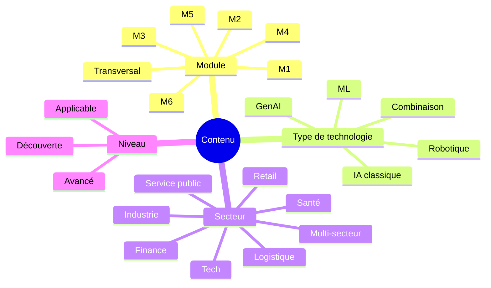
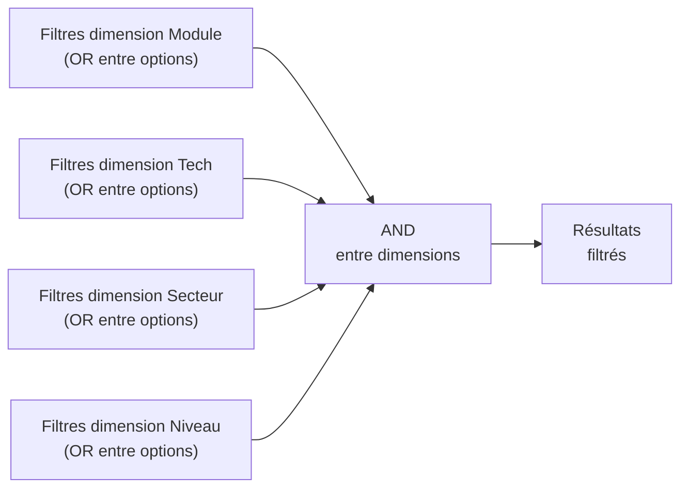

# Taxonomie de tags et filtres

> Système de tags qui permet aux utilisateurs de **filtrer** les contenus du site (pages module, études de cas, fiches PDF, vidéos, podcasts, lectures) selon **quatre dimensions orthogonales**.
> Cette taxonomie est utilisée par les composants `<FiltersBar />` (Ressources) et par les pages d'index (`/cas/`, `/quiz/`, etc.).

| Métadonnée | Valeur |
| :--- | :--- |
| **Version** | 1.0 |
| **Phase** | 2 — Architecture et design system |
| **Statut** | Ratifié — alimente la Phase 3 (collections Astro) et la Phase 4 (rédaction) |

---

## 1. Principe et exigences

### 1.1 Pourquoi une taxonomie

Les contenus du site sont **multidimensionnels** : une étude de cas peut concerner un module précis, un secteur, un type de technologie, et viser un niveau de difficulté. Plutôt que de figer une catégorie unique par contenu, la taxonomie permet à l'utilisateur de **trouver** ce qui lui correspond, depuis n'importe quel angle d'entrée.

### 1.2 Quatre dimensions



### 1.3 Exigences

- **Orthogonalité** : les 4 dimensions sont indépendantes — un contenu peut combiner librement des valeurs de chacune.
- **Exhaustivité raisonnable** : chaque contenu reçoit obligatoirement une valeur sur chaque dimension (sauf si « Transversal » ou « Multi-secteur »).
- **Stabilité** : ajouter une valeur est possible (ADR si évolution structurelle) ; renommer ou supprimer demande une révision explicite et une migration des contenus.
- **Trilingue** : les **clés techniques** sont en anglais (utilisées dans les frontmatter MDX et le code), les **labels affichés** sont traduits par langue.

---

## 2. Dimension 1 — Module

Indique le **module du programme** auquel le contenu se rattache principalement. Un contenu transversal porte le tag `transversal` ; un contenu lié à plusieurs modules porte plusieurs tags.

| Clé technique | Label FR | Label EN | Label AR | Couverture |
| :--- | :--- | :--- | :--- | :--- |
| `module-1` | Module 1 — Introduction à l'IA | Module 1 — Introduction to AI | الوحدة 1 — مقدمة في الذكاء الاصطناعي | Définitions, histoire, intelligence collective |
| `module-2` | Module 2 — Machine Learning | Module 2 — Machine Learning | الوحدة 2 — تعلّم الآلة | Apprentissage supervisé, non supervisé, renforcement |
| `module-3` | Module 3 — IA Générative | Module 3 — Generative AI | الوحدة 3 — الذكاء الاصطناعي التوليدي | Foundation models, LLM, hallucinations, pilotes |
| `module-4` | Module 4 — Robotique | Module 4 — Robotics | الوحدة 4 — الروبوتيات | Perception, planification, HRI, automatisation physique |
| `module-5` | Module 5 — IA et société | Module 5 — AI and Society | الوحدة 5 — الذكاء الاصطناعي والمجتمع | Gouvernance, éthique, travail, conformité |
| `module-6` | Module 6 — Futur de l'IA | Module 6 — Future of AI | الوحدة 6 — مستقبل الذكاء الاصطناعي | Roadmap, scénarios, intelligence collective |
| `transversal` | Transversal | Cross-cutting | شامل | Concepts/outils applicables à plusieurs modules |

---

## 3. Dimension 2 — Type de technologie

Indique le **type d'IA** ou la combinaison technologique au cœur du contenu.

| Clé technique | Label FR | Label EN | Label AR | Description courte |
| :--- | :--- | :--- | :--- | :--- |
| `tech-ml` | Machine Learning | Machine Learning | تعلّم الآلة | Apprentissage statistique classique (supervisé, non supervisé, renforcement) |
| `tech-genai` | IA Générative | Generative AI | ذكاء اصطناعي توليدي | Foundation models, LLMs, génération de texte/image/code |
| `tech-robotics` | Robotique | Robotics | روبوتيات | Robots physiques, perception, contrôle, navigation |
| `tech-classical` | IA classique | Classical AI | ذكاء اصطناعي تقليدي | Systèmes experts, règles, optimisation, recherche |
| `tech-combined` | Combinaison | Combined | مزيج | Hybridation de plusieurs technologies (ex. ML + robotique) |
| `tech-none` | Sans IA spécifique | No specific AI | بدون ذكاء اصطناعي محدّد | Stratégie, gouvernance, méthode (le contenu porte sur l'IA en général) |

---

## 4. Dimension 3 — Secteur d'activité

Indique le **secteur** dans lequel le contenu trouve son application principale. Pour un contenu généraliste, utiliser `multi-secteur`.

| Clé technique | Label FR | Label EN | Label AR |
| :--- | :--- | :--- | :--- |
| `sector-finance` | Finance et services financiers | Finance & Banking | تمويل ومصرفية |
| `sector-health` | Santé et sciences du vivant | Healthcare & Life Sciences | صحة وعلوم حياة |
| `sector-retail` | Retail et e-commerce | Retail & E-commerce | تجزئة وتجارة إلكترونية |
| `sector-logistics` | Logistique et supply chain | Logistics & Supply Chain | لوجستيات وسلسلة التوريد |
| `sector-tech` | Tech et logiciel | Technology & Software | تقنية وبرمجيات |
| `sector-industry` | Industrie et manufacturing | Industry & Manufacturing | صناعة وتصنيع |
| `sector-public` | Service public et institutions | Public Sector & Institutions | قطاع عام ومؤسسات |
| `sector-services` | Services professionnels et conseil | Professional Services & Consulting | خدمات احترافية واستشارات |
| `sector-education` | Éducation et formation | Education & Training | تعليم وتكوين |
| `sector-multi` | Multi-secteur | Multi-sector | متعدد القطاعات |

---

## 5. Dimension 4 — Niveau de difficulté

Indique la **profondeur d'expertise** attendue ou apportée par le contenu. Aligné sur les 3 audiences principales et la triple lecture (cf. ADR-004).

| Clé technique | Label FR | Label EN | Label AR | Audience principale |
| :--- | :--- | :--- | :--- | :--- |
| `level-discovery` | Découverte | Discovery | اكتشاف | Tout public, primo-arrivants sur l'IA |
| `level-applicable` | Applicable | Applicable | تطبيقي | Managers, consultants, enseignants |
| `level-advanced` | Avancé | Advanced | متقدّم | Sponsors techniques, dirigeants experts |

### 5.1 Repères pour le tagging

- **Découverte** : pose les définitions, n'exige aucun prérequis, donne des exemples métier simples. ⚠️ « Découverte » ne signifie pas « simpliste » : la rigueur reste maximale, c'est l'angle d'attaque qui est généraliste.
- **Applicable** : permet d'agir — décider, prioriser, cadrer un pilote, rédiger un mémo, présenter en COMEX. C'est le **niveau par défaut** du site.
- **Avancé** : approfondit un point méthodologique ou stratégique avec une exigence supérieure (par exemple : « Décomposer un workflow GenAI selon le coût total d'automatisation »).

---

## 6. Frontmatter MDX standard

Tout contenu publié dans `src/content/<lang>/...` porte un frontmatter standardisé qui inclut les 4 dimensions de la taxonomie. Exemple pour une étude de cas :

```yaml
---
title: "Morgan Stanley — IA générative pour la recherche financière"
slug: "morgan-stanley-genai"
description: "Comment Morgan Stanley a déployé un assistant IA générative interne (AskResearchGPT, Debrief) pour ses analystes."
publishedAt: 2026-05-15
updatedAt: 2026-05-15
author: "Mohamed El Afrit"
modules: ["module-3", "module-5"]
tech: ["tech-genai"]
sectors: ["sector-finance"]
level: "level-applicable"
sources:
  - level: "external-verifiable"
    title: "Morgan Stanley — AI @ Morgan Stanley Assistant"
    url: "https://www.morganstanley.com/..."
relatedModules: ["module-3", "module-5"]
relatedCases: ["github-copilot-accenture", "klarna-ai-assistant"]
podcastEpisode: "episode-04"
hasQuiz: true
estimatedReadingMinutes: 12
---
```

### 6.1 Règles d'utilisation

- `modules` est un **tableau** : un cas peut être lié à plusieurs modules.
- `tech` est un tableau (cf. cas hybrides ML + robotique).
- `sectors` est un tableau (utiliser `["sector-multi"]` pour les contenus généralistes).
- `level` est **toujours une chaîne unique** (un contenu vise un niveau, pas plusieurs).
- `sources[].level` ∈ `{official-mit, recommended-complement, pedagogical-reconstruction, external-verifiable, to-verify}`.

---

## 7. Filtres et combinaisons

### 7.1 Logique de combinaison

Les filtres au sein d'une dimension sont en **OR** logique : cocher Module 1 et Module 3 retourne les contenus liés à M1 OU M3.

Les filtres entre dimensions sont en **AND** logique : cocher Module 3 + secteur Finance retourne les contenus liés à M3 ET au secteur Finance.



### 7.2 Affichage des résultats

- **Tri par défaut** : pertinence (heuristique simple — récence + alignement avec filtres actifs).
- **Tri alternatif** : alphabétique, date de publication, niveau croissant.
- **Indicateur de cardinalité** : nombre total de résultats affiché en permanence (« 12 ressources correspondent »).
- **Reset** : bouton « Effacer les filtres » toujours visible si au moins un filtre est actif.

### 7.3 Préservation des filtres dans l'URL

Les filtres actifs sont reflétés dans la query string pour permettre le partage et le bookmark.

| Pattern d'URL | Signification |
| :--- | :--- |
| `/fr/ressources/?module=module-3` | Filtre Module 3 actif |
| `/fr/ressources/?tech=tech-genai&sector=sector-finance` | Combinaison |
| `/fr/cas/?level=level-applicable&module=module-3,module-5` | Cas niveau Applicable, modules 3 ou 5 |

Les valeurs multiples par dimension sont séparées par virgule.

---

## 8. Indices et métriques de qualité

Pour vérifier la santé de la taxonomie au fil du temps, suivre :

| Métrique | Cible | Action si dérive |
| :--- | :--- | :--- |
| Couverture du tagging | 100 % des contenus ont les 4 dimensions remplies | Audit éditorial fin de phase |
| Distribution équilibrée par module | Au moins 2 contenus par module | Production complémentaire prioritaire |
| Distribution par niveau | ≥ 60 % en `applicable`, ~20 % en `discovery`, ~20 % en `advanced` | Réquilibrage éditorial |
| Diversité sectorielle | ≥ 6 secteurs représentés sur les études de cas | Recherche ciblée de cas manquants |

---

## 📎 Documents associés

- [Sitemap](./sitemap.md)
- [Gabarits de pages](./gabarits/) — chaque gabarit indique comment la taxonomie alimente sa structure
- [Charte de cadrage](../cadrage/charte-de-cadrage.md)
