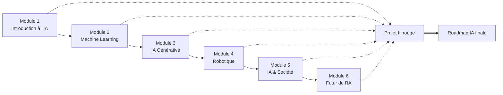
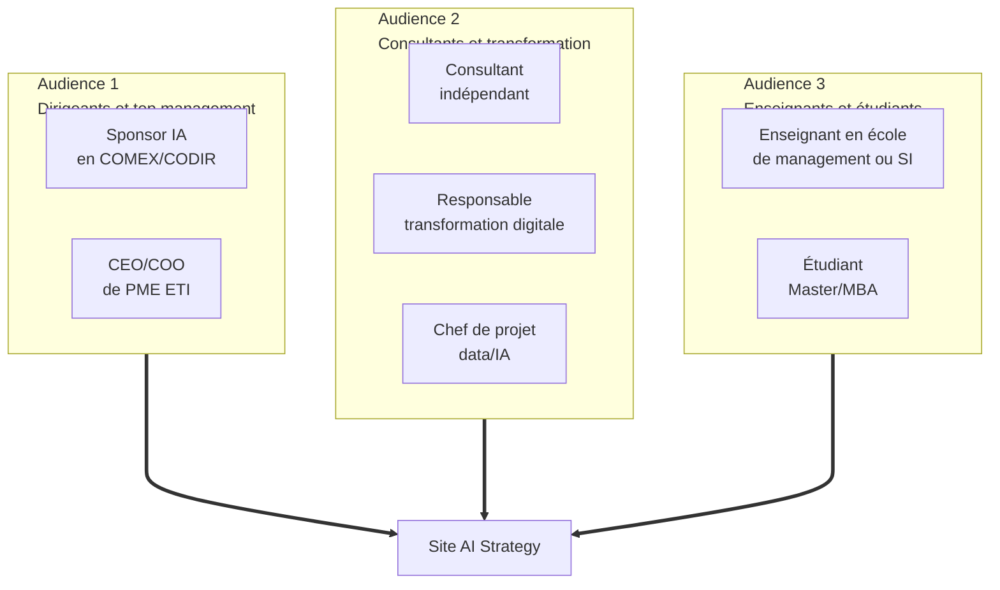

# Charte de cadrage — AI Strategy

> Document maître de la **Phase 1 — Cadrage et identité**.
> Consolide la vision éditoriale, les principes structurants et les **10 décisions de cadrage** prises lors du lancement du projet.
> Tous les choix de production ultérieurs (architecture, design, contenu) doivent être cohérents avec cette charte.

| Métadonnée | Valeur |
| :--- | :--- |
| **Version** | 1.0 |
| **Date** | Mai 2026 |
| **Auteur** | Mohamed El Afrit |
| **Statut** | Ratifié — en vigueur |
| **Prochain examen** | Fin de Phase 2 (validation par retour d'expérience design) |

---

## 1. Préambule

Le projet **AI Strategy** vise à produire un site web pédagogique trilingue, professionnel et indépendant, **inspiré** du programme exécutif *Artificial Intelligence: Implications for Business Strategy* de MIT Sloan School of Management et MIT Computer Science and Artificial Intelligence Laboratory (CSAIL).

Le site n'est **pas** une copie ni une reproduction du programme MIT. Il s'agit d'une ressource pédagogique originale, élaborée à partir de sources publiques, qui rend les enjeux managériaux et stratégiques de l'intelligence artificielle accessibles à un lectorat francophone élargi (puis anglophone et arabophone).

Cette charte fixe les fondations stratégiques, éditoriales et opérationnelles du projet. Elle est volontairement **synthétique et actionnable** : elle ne remplace pas les documents de design, d'architecture ou de contenu qui seront produits dans les phases ultérieures, mais elle les contraint et les oriente.

---

## 2. Programme MIT de référence

### 2.1 Identité du programme

| Élément | Valeur attestée publiquement |
| :--- | :--- |
| Organisme | MIT Sloan School of Management + MIT CSAIL |
| Format | 100 % en ligne, auto-rythmé |
| Durée | 6 semaines hors orientation |
| Charge | 6 à 8 h par semaine (4–5 h cœur + 2–3 h extensions optionnelles) |
| Positionnement | Managérial et stratégique — non technique |
| Projet | Plan d'usage de l'IA pour son organisation (livrable individuel) |
| Audience | Managers, dirigeants, consultants, profils data/marketing/sales |
| Prérequis techniques | Aucun prérequis technologique explicite |

### 2.2 Architecture des six modules

### 2.3 Niveaux de certitude des sources

Le rapport analytique préalable (situé dans le dossier projet d'origine) hiérarchise quatre niveaux de preuve appliqués à toutes les informations sur le programme. Cette hiérarchie est **reprise et imposée** dans tout le contenu pédagogique du site :

| Niveau | Étiquette éditoriale | Sources types |
| :--- | :--- | :--- |
| 1. Officiel actuel | `Source officielle MIT` | Page du programme MIT Executive Education, sample schedule officiel |
| 2. MIT connexe | `Complément recommandé` | MIT Sloan Ideas Made to Matter, MIT OpenCourseWare, MIT News, MIT CCI |
| 3. Reconstruction pédagogique | `Reconstruction pédagogique` | Synthèses produites à partir de sources fiables alignées sur le programme |
| 4. Sources primaires externes | `Source externe vérifiable` | NIST, OCDE, AI Act UE, NBER, articles d'entreprise sourcés |

Toute information dont la source ne peut être ramenée à l'un de ces quatre niveaux est explicitement signalée comme **« À vérifier »** ou simplement **non publiée**.

---

## 3. Vision éditoriale

### 3.1 Mission

> *Rendre la stratégie IA actionnable pour les décideurs francophones, anglophones et arabophones, en transposant fidèlement les enjeux du programme MIT Sloan dans un format ouvert, rigoureusement sourcé, et exploitable en formation comme en mission de conseil.*

### 3.2 Promesse de valeur

Le site offre **trois pistes de lecture en parallèle** sur chaque page de contenu :

1. **Synthèse exécutive** — pour le dirigeant qui dispose de 5 minutes.
2. **Contenu pédagogique complet** — pour l'apprenant et l'enseignant.
3. **Annexes opérationnelles téléchargeables** — pour le consultant qui exécute.

Cette superposition est la **signature éditoriale du site** et le distingue à la fois des MOOC classiques (souvent trop linéaires) et des blogs corporate (souvent trop superficiels).

### 3.3 Posture vis-à-vis de MIT

Le site assume une **indépendance éditoriale stricte** :

- Aucune affiliation, validation ou certification revendiquée auprès de MIT.
- Aucune reproduction de contenu propriétaire MIT.
- Aucune utilisation des marques MIT au-delà des mentions descriptives nécessaires (« inspiré du programme MIT Sloan… »).
- Mentions légales claires sur chaque page concernant cette indépendance.
- Citations courtes et sourcées uniquement, conformément aux usages académiques.

### 3.4 Différenciation par rapport à l'offre existante

| Concurrent type | Limite identifiée | Réponse du site AI Strategy |
| :--- | :--- | :--- |
| MOOC traditionnel | Linéaire, peu d'annexes opérationnelles | Triple lecture, fiches PDF granulaires, capstone roadmap |
| Blog corporate IA | Superficiel, mal sourcé, biais commercial | Hiérarchie des sources visible, indépendance éditoriale |
| Manuel académique | Inaccessible aux non-spécialistes | Orientation business-first, pas de formalisme mathématique |
| Site de cabinet de conseil | Frameworks propriétaires fermés | Templates et matrices ouvertes sous CC BY-NC-SA |
| Contenu francophone existant | Rare, fragmenté, traductions rapides | Production native FR avec parité EN/AR |

---

## 4. Audiences et personas préliminaires

> Ces personas sont **préliminaires** et seront détaillés en Phase 2 (`docs/personas-parcours/`). Ils sont posés ici pour calibrer dès maintenant le ton et la profondeur des contenus.

### 4.1 Trois audiences principales

### 4.2 Personas types — esquisse

| Persona | Profil | Besoin clé | Usage privilégié du site |
| :--- | :--- | :--- | :--- |
| **« Claire, COO »** | 45 ans, COMEX, PME 800 personnes | Cadrer une stratégie IA crédible en 3 mois | Synthèses exécutives, capstone roadmap, podcasts |
| **« Karim, consultant senior »** | 35 ans, indépendant, missions transfo | Templates clients prêts à l'emploi | Fiches granulaires, matrices, checklist exécutive |
| **« Léa, enseignante en MBA »** | 40 ans, école de management | Dispositif pédagogique structuré, quiz, rubrics | Fiches concepts, quiz, glossaire, capstone |
| **« Yacine, étudiant Master SI »** | 24 ans, Master Systèmes d'Information | Comprendre la stratégie IA pour son mémoire | Pages module, podcasts, glossaire |

---

## 5. Les dix décisions de cadrage

Cette section documente les **10 décisions structurantes** prises lors du cadrage initial. Chaque décision est tracée plus en détail dans le [journal des décisions](./decisions-log.md) au format Architecture Decision Record (ADR).

### Décision 1 — Identité et naming

| Champ | Valeur |
| :--- | :--- |
| **Choix** | Site nommé **AI Strategy**, repository GitHub `ai-strategy` |
| **Rationale** | Nom court, mémorable, neutre linguistiquement (fonctionne en FR/EN/AR sans traduction), aligné sur le positionnement éditorial |
| **Alternatives écartées** | « Académie IA & Stratégie » (trop francophone), « Décision IA » (trop court, ambigu) |
| **Conséquences** | Branding sobre, slug `github.com/melafrit/ai-strategy`, identité visuelle compatible international |

### Décision 2 — Stack technique

| Champ | Valeur |
| :--- | :--- |
| **Choix** | **Astro** (dernière version stable) avec contenu MDX et îlots interactifs React |
| **Rationale** | Content-first, build 100 % statique, i18n natif, Lighthouse élevé, JS minimal, support RTL |
| **Alternatives écartées** | Next.js (plus lourd), Hugo (moins flexible), Docusaurus (trop "docs") |
| **Conséquences** | Structure repo orientée content collections, MDX pour pages riches, React uniquement où interactivité nécessaire |

### Décision 3 — Hébergement

| Champ | Valeur |
| :--- | :--- |
| **Choix** | Infrastructure **OVH** propriétaire de l'auteur |
| **Rationale** | Souveraineté, indépendance vis-à-vis des plateformes cloud externes, contrôle total |
| **Alternatives écartées** | GitHub Pages, Vercel, Cloudflare Pages |
| **Conséquences** | Workflow GitHub Actions de déploiement SFTP/FTP vers OVH ; `.htaccess` pour redirections multilingues ; certificat Let's Encrypt OVH ; type d'hébergement OVH précis à confirmer en Phase 3 |

### Décision 4 — Public prioritaire

| Champ | Valeur |
| :--- | :--- |
| **Choix** | **Public hybride** : Enseignant + Consultant + Dirigeants & top management |
| **Rationale** | Profil personnel de l'auteur (formateur + consultant), positionnement marché, cohérence avec MIT Sloan Executive Education |
| **Alternatives écartées** | Choix mono-audience (dirigeants seuls / consultants seuls / pédagogique seul) |
| **Conséquences** | Discipline rédactionnelle exigeante : chaque page doit servir simultanément les 3 usages via la triple lecture (synthèse exécutive / contenu pédagogique / annexes opérationnelles) |

### Décision 5 — Direction visuelle

| Champ | Valeur |
| :--- | :--- |
| **Choix** | **Consulting Modern** — sans-serif (IBM Plex), blanc pur, navy/charbon, accent bleu corporate |
| **Rationale** | Crédibilité C-level, sobriété éditoriale, parfaite cohérence trilingue (IBM Plex Sans Arabic), supporte densité informationnelle |
| **Alternatives écartées** | Editorial Business School (serif/cream/navy), Editorial Tech, Minimal Swiss strict |
| **Conséquences** | Design tokens : `--ai-bg: #FFFFFF`, `--ai-fg: #0F1E2E`, `--ai-accent: #0066CC` (à finaliser en Phase 2). Iconographie Lucide. Encadrés signature `Source officielle / Complément / Reconstruction pédagogique` en filets fins navy. |

### Décision 6 — Architecture multilingue

| Champ | Valeur |
| :--- | :--- |
| **Choix** | **Sous-dossiers symétriques** `/fr/`, `/en/`, `/ar/` avec redirection automatique de `/` selon langue navigateur (fallback FR) |
| **Rationale** | Best practice SEO 2026, parité éditoriale entre langues (équité culturelle pour AR), maintenance unique, évolutivité (4e langue triviale) |
| **Alternatives écartées** | FR sans préfixe + autres préfixés (asymétrie), sous-domaines (complexité DNS), domaines distincts (sur-ingénierie) |
| **Conséquences** | `astro.config.mjs` avec `i18n: { defaultLocale: 'fr', locales: ['fr', 'en', 'ar'] }` ; un sélecteur de langue persistant dans le header ; `dir="rtl"` activé sur `/ar/` ; balises `hreflang` croisées sur chaque page |

### Décision 7 — Granularité des fiches PDF

| Champ | Valeur |
| :--- | :--- |
| **Choix** | **Hybride** : 1 PDF synthèse complète par module + extraits granulaires (concepts, cas, outils, quiz) |
| **Rationale** | Maximise la valeur pédagogique sans dupliquer le travail rédactionnel (les extraits sont des sections du master) ; SEO long-tail amplifié ; usage flexible (formation / mission / autoformation) |
| **Alternatives écartées** | Synthèse par module seule (insuffisamment granulaire), bibliothèque transversale par tag (perte du fil narratif), modulaire pure (lourd à maintenir) |
| **Conséquences** | Volume cible ~30 PDFs par langue. Génération via Pandoc + Paged.js depuis sources MDX. QR code sur chaque fiche. Indexation par filtres (module / type / secteur) sur la page Ressources. |

### Décision 8 — Stratégie podcasts NotebookLM

| Champ | Valeur |
| :--- | :--- |
| **Choix** | **Série narrative en saison** — 10 épisodes liés couvrant le parcours complet, format `.m4a` |
| **Rationale** | Engagement auditeur supérieur à une collection d'épisodes indépendants ; signature éditoriale distinctive sur le marché francophone ; renforce le positionnement "académie" plutôt que "blog" |
| **Alternatives écartées** | 1 podcast par module (linéaire), thématiques transversales (peu narrative), granulaire par concept (fragmenté) |
| **Conséquences** | Architecture en 5 actes (Comprendre / Décider / Déployer / Gouverner / Anticiper) ; ~3h30–4h00 d'écoute totale ; page dédiée "Saison 1" servant d'entrée alternative au site ; placeholders audio embarqués sur chaque page module concernée |

### Décision 9 — Stratégie quiz et évaluations

| Champ | Valeur |
| :--- | :--- |
| **Choix** | **Quiz interactifs avec persistance locale** (`localStorage`) — scoring instantané, badges, progression sauvegardée dans le navigateur |
| **Rationale** | Engagement utilisateur supérieur, RGPD-safe, aucun backend, aucune dépendance externe, compatible avec le triple usage (cours / formation / mission) |
| **Alternatives écartées** | Statique non interactif (peu engageant), interactif sans persistance (sentiment de non-progression), backend cloud (ajoute complexité et coût) |
| **Conséquences** | Composant React en îlot Astro (`client:visible`) ; 7 questions par module + 1 quiz capstone diagnostic = ~50 questions FR à produire (dupliquées EN/AR) ; accessibilité AA ; mode imprimable préservant les questions |

### Décision 10 — Mode de transfert vers GitHub

| Champ | Valeur |
| :--- | :--- |
| **Choix** | **Push direct sur `main`** depuis l'environnement Claude via fine-grained Personal Access Token |
| **Rationale** | Vélocité maximale, visibilité immédiate des livrables, possibilité de `git revert` si correction nécessaire ; le repo public valorise le travail au fil de l'eau |
| **Alternatives écartées** | Téléchargement et commit manuel (lent), scripts git locaux (intermédiaire), branche feature avec PR (sur-ingénierie pour ce contexte) |
| **Conséquences** | Token fine-grained scopé au seul repo `ai-strategy`, permissions Contents read/write uniquement, expiration 30 jours renouvelable, à révoquer en fin de projet ; messages Conventional Commits ; CHANGELOG mis à jour à chaque phase |

---

## 6. Principes éditoriaux

Quatre principes structurent la rigueur du contenu publié sur le site et dans les fiches PDF.

### 6.1 Principe de hiérarchie visible des sources

Toute affirmation factuelle est rattachée à un niveau de preuve explicite, signalé visuellement par des encadrés signature. Ce principe est plus exigeant que la pratique courante des sites pédagogiques, et constitue un des marqueurs de crédibilité du site.

### 6.2 Principe de zéro source inventée

Aucune citation, aucune statistique, aucun cas d'entreprise, aucun nom de chercheur, aucune publication ne sera mentionné sans qu'une source publique vérifiable puisse être référencée. En cas d'absence de source fiable, l'affirmation est soit retirée, soit reformulée comme question ouverte, soit explicitement signalée comme « À vérifier ».

### 6.3 Principe d'indépendance vis-à-vis de MIT

Le site n'utilise aucune marque ni logo MIT au-delà des mentions descriptives nécessaires. Une mention légale d'indépendance est présente sur chaque page de contenu. Aucun contenu propriétaire MIT n'est reproduit ; seules des paraphrases originales avec citations courtes et sourcées sont admises.

### 6.4 Principe de respect des droits d'auteur

Le site applique strictement les règles d'usage équitable des sources externes : citations courtes (limites légales), paraphrase systématique, attribution claire, lien vers la source originale. Les médias (images, vidéos, podcasts) reposent soit sur des productions originales, soit sur des sources sous licence libre, soit sur des intégrations conformes aux conditions d'utilisation des plateformes (YouTube embed, etc.).

---

## 7. Engagements de qualité

| Domaine | Engagement minimal | Mesure / preuve |
| :--- | :--- | :--- |
| **Accessibilité** | WCAG 2.1 niveau AA | Audit Pa11y / axe en CI |
| **Performance** | Lighthouse > 90 sur les 4 métriques (Performance, Accessibility, Best Practices, SEO) | Audit Lighthouse en CI |
| **SEO multilingue** | `hreflang` croisés, canonicals, sitemaps par langue, Schema.org | Validation Search Console |
| **Trilingue** | Parité de contenu entre FR/EN/AR sur les pages publiées | Tableau de suivi de traduction en Phase 7 |
| **Sources** | 100 % des affirmations factuelles tracées au niveau 1, 2, 3 ou 4 | Audit éditorial à chaque fin de phase |
| **Indépendance** | Mention sur chaque page module et études de cas | Composant `<IndependenceNotice />` global |

---

## 8. Limites et hors-périmètre

Pour éviter les dérives de scope, sont explicitement **exclus** du périmètre du site :

- ❌ Toute fonctionnalité de **plateforme LMS** (gestion d'utilisateurs, certificats, suivi de cohorte, examens proctorés).
- ❌ Toute revendication de **certification** ou d'équivalence avec le programme MIT.
- ❌ Toute reproduction de **contenu propriétaire** MIT (vidéos officielles, exercices internes, slides du programme).
- ❌ Tout **forum communautaire** ou système de commentaires (lourdeur de modération, RGPD).
- ❌ Tout contenu **purement technique** (cours de Python, tutoriel scikit-learn, exercices Kaggle) — le positionnement reste managérial.
- ❌ Tout suivi **analytique invasif** ou cookies tiers (le site reste RGPD-friendly par conception).

Si un de ces périmètres devenait pertinent ultérieurement, il ferait l'objet d'une **révision explicite de la charte** documentée dans `decisions-log.md`.

---

## 9. Gouvernance projet

### 9.1 Mode de transfert et de production

| Aspect | Convention retenue |
| :--- | :--- |
| **Repository** | `github.com/melafrit/ai-strategy` (public) |
| **Branche principale** | `main` (push direct autorisé en Phase 1, branches feature à partir de Phase 4 si contributions externes) |
| **Convention de commits** | [Conventional Commits](https://www.conventionalcommits.org/fr/v1.0.0/) (`feat:`, `fix:`, `docs:`, `content:`, `chore:`, etc.) |
| **Versionnement** | Sémantique sur le code (`SemVer`), date-based sur le contenu pédagogique (`v1.0 — 2026-05`) |
| **CHANGELOG** | Mis à jour à chaque fin de phase, format [Keep a Changelog](https://keepachangelog.com/fr/1.1.0/) |

### 9.2 Modification de la charte

La charte de cadrage peut être modifiée si le contexte évolue, mais selon la procédure suivante :

1. Toute proposition de modification est documentée dans une **nouvelle entrée du journal des décisions** (`decisions-log.md`) en référence à l'ADR initial qu'elle remplace.
2. La modification est appliquée à la charte avec un **commit dédié** au format `docs(cadrage): supersede ADR-XXX with ADR-YYY`.
3. Le `CHANGELOG.md` mentionne explicitement l'évolution dans la rubrique `Changed`.

Cette procédure garantit la **traçabilité historique** et permet à toute personne arrivant sur le projet de comprendre comment il a évolué.

### 9.3 Gestion du token GitHub

- Le fine-grained PAT utilisé pour la production est scopé au seul repo `ai-strategy`.
- Il dispose des permissions minimales (`Contents: Read and write`).
- Il expire à 30 jours et est renouvelable.
- Il sera **révoqué** à la fin du projet ou à toute interruption longue, conformément aux bonnes pratiques de sécurité.
- Aucun token n'est jamais committé dans le repo (cf. `.gitignore`).

---

## 10. Glossaire des termes utilisés dans la charte

| Terme | Définition opérationnelle |
| :--- | :--- |
| **ADR** | Architecture Decision Record — format documentaire d'enregistrement d'une décision avec son contexte, ses alternatives et sa motivation |
| **Capstone** | Projet final de synthèse, ici une roadmap IA pour une organisation |
| **CC BY-NC-SA 4.0** | Licence Creative Commons : Attribution + Non Commercial + Share Alike, version 4.0 internationale |
| **CSAIL** | MIT Computer Science and Artificial Intelligence Laboratory |
| **Fine-grained PAT** | Personal Access Token GitHub à granularité fine (vs. classic), permettant de scoper précisément les permissions et les ressources accessibles |
| **GetSmarter** | Plateforme partenaire de MIT pour la diffusion technique de plusieurs programmes Executive Education |
| **i18n** | Internationalization — abréviation standard pour la gestion multilingue d'un site |
| **Îlot interactif** | Composant interactif (React) embarqué dans une page Astro statique, qui charge son JavaScript uniquement quand nécessaire |
| **MDX** | Markdown étendu permettant l'usage de composants React/Astro directement dans le contenu |
| **MIT Sloan** | École de management du Massachusetts Institute of Technology |
| **NIST AI RMF** | National Institute of Standards and Technology — Artificial Intelligence Risk Management Framework |
| **OCDE / OECD** | Organisation de Coopération et de Développement Économiques |
| **RTL** | Right-to-Left, direction d'écriture de l'arabe et de l'hébreu |
| **SemVer** | Versionnement sémantique : MAJOR.MINOR.PATCH |
| **Triple lecture** | Principe éditorial de superposition de trois niveaux de profondeur sur chaque page (synthèse exécutive / contenu pédagogique / annexes opérationnelles) |

---

## 📎 Documents associés

- [Planning détaillé en 7 phases](./planning.md)
- [Journal des décisions (ADR)](./decisions-log.md)
- [Index de la documentation projet](../README.md)
- [README principal du projet](../../README.md)

---

*Charte ratifiée à l'issue de la Phase 1 — Cadrage et identité. Toute modification ultérieure est documentée dans le journal des décisions.*
