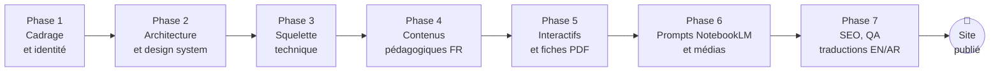

# Planning détaillé — Production du site AI Strategy

> Plan de production en **7 phases séquentielles** avec recouvrements ponctuels.
> Chaque phase produit des livrables concrets versionnés sur GitHub et termine sur une **revue éditoriale** avant de passer à la suivante.

| Métadonnée | Valeur |
| :--- | :--- |
| **Version** | 1.0 |
| **Date** | Mai 2026 |
| **Auteur** | Mohamed El Afrit |
| **Statut** | En vigueur — Phase 1 active |

---

## 0. Vue d'ensemble

### 0.1 Diagramme synthétique des phases



### 0.2 Tableau résumé

| # | Phase | Objectif principal | Livrables clés | Effort estimé* |
| :---: | :--- | :--- | :--- | :---: |
| 1 | Cadrage et identité | Fixer la vision et les arbitrages structurants | Charte, planning, journal des décisions, repo initialisé | 1–2 itérations |
| 2 | Architecture et design system | Définir IA, navigation, design tokens, personas | Sitemap, gabarits, design system, personas, parcours | 2–3 itérations |
| 3 | Squelette technique | Repo Astro fonctionnel, i18n, déploiement OVH | Projet Astro init, config i18n, workflow CI/CD, composants de mise en page de base | 2–3 itérations |
| 4 | Contenus pédagogiques FR | Rédiger toutes les pages du site en français | Accueil, Overview, 6 modules, ~10 cas, Ressources, Glossaire, FAQ, À propos | 6–8 itérations |
| 5 | Composants interactifs et fiches | Construire les éléments interactifs et les ~30 PDFs | Quiz, matrices, roadmap builder, fiches PDF, QR codes | 3–4 itérations |
| 6 | Prompts NotebookLM et médias | Préparer les prompts et placeholders média | 10 prompts podcasts + 6 slides + 6 infographies, page Saison 1 | 2–3 itérations |
| 7 | SEO, QA, traductions EN/AR | Optimiser, auditer, traduire | SEO, sitemap, Schema.org, traductions EN/AR, RTL, audit final | 3–4 itérations |

*Une itération ≈ une session de travail Claude générant un lot de livrables cohérents. Les durées réelles dépendent de votre disponibilité de validation entre itérations.*

### 0.3 Recouvrements et exceptions

Bien que le plan soit séquentiel, deux recouvrements sont prévus :

- **Phase 6 ↔ Phase 4** : les placeholders médias peuvent être insérés dès la Phase 4 si le rendu des pages le justifie.
- **Phase 7 ↔ Phase 4** : les balises SEO de base (titles, meta) sont posées dès la Phase 4 ; la Phase 7 affine et industrialise.

---

## Phase 1 — Cadrage et identité

### 🎯 Objectif

Fixer la vision éditoriale, les arbitrages structurants, et initialiser un repository GitHub propre qui servira de socle à toutes les phases suivantes.

### 📦 Périmètre détaillé

| Inclus dans la phase | Explicitement hors phase |
| :--- | :--- |
| Charte de cadrage maître | Maquettes visuelles |
| Journal des 10 décisions (ADR) | Code Astro |
| Planning détaillé | Contenu pédagogique |
| Repository GitHub initialisé | Sitemap final |
| Licences MIT + CC BY-NC-SA 4.0 | Personas détaillés (esquisse seulement) |
| README bilingue FR/EN | |
| `.gitignore` Astro-ready | |
| CHANGELOG initialisé | |

### 📂 Livrables

| Fichier | Description |
| :--- | :--- |
| `README.md` | Présentation du projet en français |
| `README.en.md` | Présentation du projet en anglais |
| `LICENSE-CODE` | Licence MIT pour le code |
| `LICENSE-CONTENT` | Licence CC BY-NC-SA 4.0 pour le contenu |
| `CHANGELOG.md` | Historique des modifications, format Keep a Changelog |
| `.gitignore` | Exclusions Git Astro-ready |
| `docs/README.md` | Index de la documentation projet |
| `docs/cadrage/README.md` | Index de la phase de cadrage |
| `docs/cadrage/charte-de-cadrage.md` | Document maître |
| `docs/cadrage/planning.md` | Ce document |
| `docs/cadrage/decisions-log.md` | Journal des 10 décisions |

### ✅ Critères d'acceptation (Definition of Done)

- [x] Le repository `melafrit/ai-strategy` existe sur GitHub et est public.
- [x] La double licence est en place et clairement référencée dans le README.
- [x] La charte consolidant les 10 décisions est ratifiée.
- [x] Le planning est lisible et actionnable.
- [x] Le journal des décisions est complet (10 ADR documentés).
- [x] Le repo passe `git log` avec une histoire propre (Conventional Commits).

### 🔗 Dépendances

- Aucune (phase initiale).

### ⚠️ Risques et mitigations

| Risque | Probabilité | Impact | Mitigation |
| :--- | :--- | :--- | :--- |
| Décisions instables remettant en cause le cadrage | Faible | Élevé | Procédure ADR : toute évolution remplace explicitement un ADR antérieur, jamais d'écrasement silencieux |
| Token GitHub compromis | Faible | Moyen | Fine-grained PAT scopé, expiration courte, révocation en fin de projet |

---

## Phase 2 — Architecture et design system

### 🎯 Objectif

Produire l'**architecture de l'information complète** (sitemap, gabarits) et le **design system** (tokens, composants, règles RTL) qui guideront toute la production de contenu et de code.

### 📦 Périmètre détaillé

| Inclus dans la phase | Explicitement hors phase |
| :--- | :--- |
| Sitemap exhaustif (toutes pages, toutes langues) | Code Astro fonctionnel |
| Gabarits de pages (Home, Overview, Module, Cas, Ressources, Quiz, Capstone, Glossaire, FAQ, À propos) | Contenu rédigé |
| Personas détaillés (4–6) | Maquettes Figma haute fidélité |
| User journeys principaux (3–4) | Tests utilisateurs |
| Design tokens complets (couleurs, typo, espacement, breakpoints, ombres, radius) | |
| Catalogue des composants UI (atomes, molécules, organismes) | |
| Règles d'accessibilité (WCAG 2.1 AA) | |
| Règles RTL pour la version arabe | |
| Taxonomie de tags (module, secteur, niveau, type de ressource) | |

### 📂 Livrables

| Fichier | Description |
| :--- | :--- |
| `docs/architecture/sitemap.md` | Arborescence complète + URLs prévues |
| `docs/architecture/gabarits/home.md` | Gabarit page d'accueil |
| `docs/architecture/gabarits/overview.md` | Gabarit vue d'ensemble |
| `docs/architecture/gabarits/module.md` | Gabarit page module |
| `docs/architecture/gabarits/case-study.md` | Gabarit étude de cas |
| `docs/architecture/gabarits/resources.md` | Gabarit page Ressources |
| `docs/architecture/gabarits/quiz.md` | Gabarit page Quiz |
| `docs/architecture/gabarits/capstone.md` | Gabarit page Capstone |
| `docs/architecture/gabarits/glossary.md` | Gabarit Glossaire |
| `docs/architecture/gabarits/faq.md` | Gabarit FAQ |
| `docs/architecture/taxonomy.md` | Système de tags et filtres |
| `docs/personas-parcours/personas.md` | 4–6 personas détaillés |
| `docs/personas-parcours/user-journeys.md` | 3–4 parcours utilisateurs |
| `docs/design-system/tokens.md` | Design tokens (avec extraits CSS) |
| `docs/design-system/typography.md` | Hiérarchie typographique |
| `docs/design-system/components.md` | Catalogue de composants UI |
| `docs/design-system/rtl-rules.md` | Règles d'adaptation RTL |
| `docs/design-system/accessibility.md` | Engagements WCAG AA et patterns |
| `docs/design-system/iconography.md` | Conventions d'usage Lucide Icons |

### ✅ Critères d'acceptation

- [ ] Le sitemap couvre 100 % des pages prévues sur 3 langues, avec slugs et URLs.
- [ ] Tous les gabarits décrivent : objectif, sections, composants utilisés, CTAs, microcopies, points de vigilance.
- [ ] Les personas couvrent les 3 audiences principales avec contexte, besoins, frustrations, citations type.
- [ ] Les design tokens sont exprimés en CSS custom properties et exportables vers Tailwind config.
- [ ] Les règles RTL couvrent typographie, alignement, icônes directionnelles, listes numérotées.
- [ ] Le catalogue de composants liste 25+ composants avec usages, états, accessibilité.

### 🔗 Dépendances

- Phase 1 ratifiée (notamment les décisions 5 sur la direction visuelle et 6 sur l'i18n).

### ⚠️ Risques et mitigations

| Risque | Probabilité | Impact | Mitigation |
| :--- | :--- | :--- | :--- |
| Design tokens trop fins ou trop ouverts | Moyenne | Moyen | Limiter à 5 niveaux de spacing, 3 niveaux d'ombre, 4 weights typo |
| Sitemap qui dérive en sur-ingénierie | Moyenne | Faible | Règle : tout nouvel item doit servir au moins une audience identifiée |
| Règles RTL incomplètes | Faible | Élevé | Audit avec un locuteur arabe natif lors de la Phase 7 |

---

## Phase 3 — Squelette technique

### 🎯 Objectif

Disposer d'un **projet Astro multilingue qui build et se déploie automatiquement sur OVH**, avec les composants de mise en page de base et la navigation vide en place.

### 📦 Périmètre détaillé

| Inclus dans la phase | Explicitement hors phase |
| :--- | :--- |
| Initialisation projet Astro 4+ | Pages de contenu |
| Configuration i18n (FR/EN/AR) | Quiz / matrices interactives |
| Structure de content collections | Fiches PDF |
| MDX + plugins (`remark`, `rehype-slug`, `rehype-autolink-headings`) | |
| Composant `Header` (logo, nav, sélecteur de langue) | |
| Composant `Footer` (mentions, licence, indépendance) | |
| Composant `LanguageSwitcher` | |
| Composant `IndependenceNotice` | |
| Composant `SourceTag` (officiel / complément / reconstruction) | |
| Configuration Tailwind avec design tokens | |
| Workflow GitHub Actions de build et déploiement OVH (SFTP) | |
| Tests Lighthouse et Pa11y en CI | |
| Pages racine `/` avec redirection JS vers la langue navigateur | |
| Page 404 trilingue | |

### 📂 Livrables

| Fichier / dossier | Description |
| :--- | :--- |
| `astro.config.mjs` | Configuration Astro avec i18n |
| `package.json` | Dépendances et scripts |
| `tailwind.config.cjs` | Tailwind avec design tokens |
| `tsconfig.json` | Configuration TypeScript |
| `src/layouts/BaseLayout.astro` | Layout principal |
| `src/components/layout/Header.astro` | Header global |
| `src/components/layout/Footer.astro` | Footer global |
| `src/components/layout/LanguageSwitcher.astro` | Sélecteur de langue |
| `src/components/IndependenceNotice.astro` | Mention d'indépendance MIT |
| `src/components/SourceTag.astro` | Étiquette de niveau de preuve |
| `src/i18n/translations.ts` | Strings de traduction UI |
| `src/styles/tokens.css` | CSS custom properties (design tokens) |
| `src/styles/rtl.css` | Surcharges RTL |
| `src/pages/index.astro` | Redirection racine |
| `src/pages/[lang]/404.astro` | Page 404 multilingue |
| `.github/workflows/deploy-ovh.yml` | Workflow de déploiement |
| `.github/workflows/quality.yml` | Workflow Lighthouse + Pa11y |
| `docs/conventions/code-style.md` | Conventions de code |
| `docs/conventions/branching.md` | Stratégie de branche |
| `docs/conventions/contributing.md` | Guide de contribution |

### ✅ Critères d'acceptation

- [ ] `npm run dev` lance un serveur local fonctionnel.
- [ ] `npm run build` produit un build statique sans erreur ni warning critique.
- [ ] Les 3 versions linguistiques sont accessibles à `/fr/`, `/en/`, `/ar/` (avec contenu placeholder).
- [ ] La version arabe a `dir="rtl"` et applique correctement les surcharges CSS RTL.
- [ ] Le sélecteur de langue conserve l'URL relative au switch.
- [ ] Le workflow GitHub Actions déploie avec succès sur OVH après push sur `main`.
- [ ] Lighthouse ≥ 90 sur les 4 métriques (mesuré sur la home FR vide).

### 🔗 Dépendances

- Phase 2 ratifiée (design system + sitemap).
- Credentials FTP/SFTP OVH disponibles (à stocker en GitHub Secrets : `OVH_HOST`, `OVH_USER`, `OVH_PASSWORD` ou `OVH_SSH_KEY`).
- Type d'hébergement OVH précis confirmé (mutualisé / VPS / Cloud) pour adapter le mode de déploiement.

### ⚠️ Risques et mitigations

| Risque | Probabilité | Impact | Mitigation |
| :--- | :--- | :--- | :--- |
| Configuration `.htaccess` OVH complexe pour la redirection multilingue | Moyenne | Moyen | Prévoir une variante avec redirection JavaScript côté client si `.htaccess` ne suffit pas |
| Incompatibilité polices IBM Plex Sans Arabic en RTL | Faible | Moyen | Tests précoces avec un texte arabe représentatif |
| Workflow GitHub Actions qui dépasse le quota mensuel | Faible | Faible | Cache npm, build conditionnel sur changements de `src/` ou `public/` |

---

## Phase 4 — Contenus pédagogiques FR

### 🎯 Objectif

Rédiger l'**ensemble des pages du site en français**, avec rigueur académique, ton consulting, et respect strict de la hiérarchie des sources.

### 📦 Périmètre détaillé

| Inclus dans la phase | Explicitement hors phase |
| :--- | :--- |
| Page d'accueil | Traductions EN/AR |
| Page Vue d'ensemble du programme | Composants quiz interactifs (placeholder seulement) |
| 6 pages module | Génération PDF |
| ~10 pages études de cas | Production des podcasts |
| Page Glossaire | Production des slides/infographies |
| Page Ressources avec filtres (statiques) | |
| Page Capstone | |
| Page FAQ | |
| Page À propos / Méthode / Indépendance | |
| Mentions légales | |

### 📂 Livrables

Tous les livrables sont en MDX dans `src/content/fr/` :

| Fichier MDX | Page web |
| :--- | :--- |
| `home.mdx` | `/fr/` |
| `overview.mdx` | `/fr/programme/` |
| `modules/01-introduction-ia.mdx` | `/fr/modules/01-introduction-ia/` |
| `modules/02-machine-learning.mdx` | `/fr/modules/02-machine-learning/` |
| `modules/03-ia-generative.mdx` | `/fr/modules/03-ia-generative/` |
| `modules/04-robotique.mdx` | `/fr/modules/04-robotique/` |
| `modules/05-ia-societe.mdx` | `/fr/modules/05-ia-societe/` |
| `modules/06-futur-ia.mdx` | `/fr/modules/06-futur-ia/` |
| `cas/morgan-stanley-genai.mdx` | `/fr/cas/morgan-stanley-genai/` |
| `cas/stripe-radar-ml.mdx` | `/fr/cas/stripe-radar-ml/` |
| `cas/github-copilot-accenture.mdx` | `/fr/cas/github-copilot-accenture/` |
| `cas/amazon-robotics.mdx` | `/fr/cas/amazon-robotics/` |
| `cas/klarna-ai-assistant.mdx` | `/fr/cas/klarna-ai-assistant/` |
| `cas/takeda-superminds.mdx` | `/fr/cas/takeda-superminds/` |
| `cas/sante-depistage.mdx` | `/fr/cas/sante-depistage/` |
| `cas/gouvernance-nist-ocde-ai-act.mdx` | `/fr/cas/gouvernance-nist-ocde-ai-act/` |
| `glossaire.mdx` | `/fr/glossaire/` |
| `ressources.mdx` | `/fr/ressources/` |
| `capstone.mdx` | `/fr/capstone/` |
| `faq.mdx` | `/fr/faq/` |
| `a-propos.mdx` | `/fr/a-propos/` |
| `methode.mdx` | `/fr/methode/` |
| `mentions-legales.mdx` | `/fr/mentions-legales/` |

Structure d'une page module (réutilisée pour les 6) :

```
1. H1 SEO + sous-titre
2. Synthèse exécutive (3 minutes)
3. Objectifs d'apprentissage
4. Concepts clés (avec encadrés Source officielle / Complément / Reconstruction)
5. Erreurs fréquentes
6. Cas réel principal (lien vers page cas dédiée)
7. Mini-cas additionnel
8. Activité pratique
9. Quiz formatif (placeholder Phase 5)
10. Checklist manager
11. Application dans votre organisation
12. À retenir
13. Pour aller plus loin (lectures, vidéos, podcasts)
14. Placeholders : podcast épisode N, slide deck, infographie, vidéo YouTube
```

### ✅ Critères d'acceptation

- [ ] Toutes les pages sont rédigées en français professionnel et passent un audit éditorial.
- [ ] Chaque affirmation factuelle est accompagnée d'un `<SourceTag />` avec niveau et lien.
- [ ] Aucune source inventée n'est présente — audit vérifiable par sondage.
- [ ] Les ~10 études de cas sont sourcées sur des publications primaires (entreprise, NIST, OCDE, NBER, MIT).
- [ ] Le glossaire couvre les ~30 termes listés dans la charte.
- [ ] Les pages se navigent correctement avec breadcrumbs et liens internes.

### 🔗 Dépendances

- Phase 3 (squelette technique opérationnel).
- Disponibilité des sources publiques mentionnées dans le rapport analytique préalable.

### ⚠️ Risques et mitigations

| Risque | Probabilité | Impact | Mitigation |
| :--- | :--- | :--- | :--- |
| Source publique disparue (lien mort) | Moyenne | Moyen | Archivage Wayback Machine systématique + lien secondaire si possible |
| Formulation involontairement copiée d'une source | Faible | Élevé | Discipline de paraphrase + relecture éditoriale |
| Étude de cas dont la source primaire devient indisponible | Faible | Moyen | Privilégier les communications officielles (about.amazon.com, github.blog, mitsloan.mit.edu) sur les blogs tiers |

---

## Phase 5 — Composants interactifs et fiches PDF

### 🎯 Objectif

Construire les **composants interactifs en React** (quiz, matrices, roadmap builder) et générer la **bibliothèque de ~30 fiches PDF** téléchargeables.

### 📦 Périmètre détaillé

| Inclus dans la phase | Explicitement hors phase |
| :--- | :--- |
| Composant Quiz React avec localStorage | Backend cloud / LMS |
| Composant Matrice valeur/faisabilité interactive | Comptes utilisateurs |
| Composant Use-case canvas | Suivi multi-appareils |
| Composant Roadmap builder simplifié | |
| Composant Risk register | |
| Génération PDF via Pandoc + Paged.js | |
| ~30 fiches PDF en français (synthèses module + extraits granulaires) | |
| Page Ressources avec filtres dynamiques | |
| Génération QR codes pointant vers les pages associées | |
| Module imprimable des quiz | |

### 📂 Livrables

| Fichier / dossier | Description |
| :--- | :--- |
| `src/components/interactive/Quiz.tsx` | Composant quiz React |
| `src/components/interactive/QuizQuestion.tsx` | Sous-composant question |
| `src/components/interactive/Badges.tsx` | Affichage badges localStorage |
| `src/components/interactive/ValueFeasibilityMatrix.tsx` | Matrice 2x2 interactive |
| `src/components/interactive/UseCaseCanvas.tsx` | Canvas interactif |
| `src/components/interactive/RoadmapBuilder.tsx` | Constructeur de roadmap |
| `src/components/interactive/RiskRegister.tsx` | Registre de risques |
| `src/components/interactive/FiltersBar.tsx` | Barre de filtres Ressources |
| `src/lib/storage.ts` | Wrapper localStorage typé |
| `build/pdf/generate.mjs` | Script de génération PDF |
| `build/pdf/template.css` | Feuille de style Paged.js |
| `public/fiches/fr/synthese/M1-synthese-introduction-ia.pdf` | Synthèse Module 1 |
| `public/fiches/fr/synthese/M2-synthese-machine-learning.pdf` | Synthèse Module 2 |
| `public/fiches/fr/synthese/M3-synthese-ia-generative.pdf` | Synthèse Module 3 |
| `public/fiches/fr/synthese/M4-synthese-robotique.pdf` | Synthèse Module 4 |
| `public/fiches/fr/synthese/M5-synthese-ia-societe.pdf` | Synthèse Module 5 |
| `public/fiches/fr/synthese/M6-synthese-futur-ia.pdf` | Synthèse Module 6 |
| `public/fiches/fr/concepts/...` | ~6 fiches concepts |
| `public/fiches/fr/cas/...` | ~6 fiches cas synthétiques |
| `public/fiches/fr/outils/...` | ~6 templates et matrices |
| `public/fiches/fr/quiz/...` | ~6 quiz imprimables avec corrigés |
| `public/fiches/fr/transversales/charte-gouvernance-ia.pdf` | Fiche transversale gouvernance |
| `public/fiches/fr/transversales/glossaire-complet.pdf` | Glossaire imprimable |
| `public/fiches/fr/CAPSTONE-roadmap-ia.pdf` | Template roadmap finale |

### ✅ Critères d'acceptation

- [ ] Tous les composants interactifs sont accessibles au clavier et lecteurs d'écran.
- [ ] Les quiz fonctionnent hors ligne après premier chargement.
- [ ] La progression est conservée d'une session à l'autre (localStorage).
- [ ] Les ~30 fiches PDF sont régénérables automatiquement à partir des sources MDX.
- [ ] Chaque fiche contient un QR code, un identifiant unique, une date de version.
- [ ] La page Ressources permet de filtrer par module / type / secteur / niveau.

### 🔗 Dépendances

- Phase 4 (contenus FR rédigés et stables, base à partir de laquelle les fiches sont extraites).

### ⚠️ Risques et mitigations

| Risque | Probabilité | Impact | Mitigation |
| :--- | :--- | :--- | :--- |
| Mise en page PDF cassée par Paged.js sur certains contenus | Moyenne | Moyen | CSS de fallback simple ; relecture visuelle de chaque PDF |
| Composants React qui dégradent les performances Lighthouse | Moyenne | Moyen | `client:visible` strict, lazy load, code splitting |
| QR codes non scannables après impression | Faible | Faible | Test sur impression 600 DPI, taille minimale 2 cm |

---

## Phase 6 — Prompts NotebookLM et placeholders médias

### 🎯 Objectif

Préparer les **prompts NotebookLM** pour générer la saison de podcast, les slides et les infographies, et insérer les **placeholders correspondants** dans les pages du site.

### 📦 Périmètre détaillé

| Inclus dans la phase | Explicitement hors phase |
| :--- | :--- |
| 10 prompts pour les épisodes de podcast (1 fichier par épisode) | Génération effective des médias (faite par l'auteur dans NotebookLM) |
| 6 prompts pour slides (1 par module) | Hébergement des fichiers audio sur un CDN |
| 6 prompts pour infographies (1 par module) | Transcription des podcasts |
| Page dédiée Saison 1 du podcast | |
| Composant `<AudioPlayer />` pour les podcasts | |
| Composant `<SlideEmbed />` pour les slides | |
| Composant `<InfographicCard />` pour les infographies | |
| Composant `<YouTubeEmbed />` privacy-friendly | |
| Curation YouTube initiale (10–15 vidéos publiques pertinentes) | |
| Placeholders en attente sur les pages module | |

### 📂 Livrables

Prompts NotebookLM (un fichier par prompt, comme exigé) :

| Fichier prompt | Fichier de sortie attendu |
| :--- | :--- |
| `prompts/notebooklm/podcast-saison-01-episode-01.md` | `S01E01-pourquoi-ia-change-strategie.m4a` |
| `prompts/notebooklm/podcast-saison-01-episode-02.md` | `S01E02-decrypter-familles-ia.m4a` |
| `prompts/notebooklm/podcast-saison-01-episode-03.md` | `S01E03-machine-learning-decision.m4a` |
| `prompts/notebooklm/podcast-saison-01-episode-04.md` | `S01E04-ia-generative-au-travail.m4a` |
| `prompts/notebooklm/podcast-saison-01-episode-05.md` | `S01E05-robotique-automatisation.m4a` |
| `prompts/notebooklm/podcast-saison-01-episode-06.md` | `S01E06-choisir-lancer-pilote.m4a` |
| `prompts/notebooklm/podcast-saison-01-episode-07.md` | `S01E07-roi-gestion-risque.m4a` |
| `prompts/notebooklm/podcast-saison-01-episode-08.md` | `S01E08-gouvernance-ethique-conformite.m4a` |
| `prompts/notebooklm/podcast-saison-01-episode-09.md` | `S01E09-ia-travail-competences.m4a` |
| `prompts/notebooklm/podcast-saison-01-episode-10.md` | `S01E10-construire-roadmap-ia.m4a` |
| `prompts/notebooklm/slides-module-01.md` | `slides-M1-introduction-ia.pdf` |
| `prompts/notebooklm/slides-module-02.md` | `slides-M2-machine-learning.pdf` |
| `prompts/notebooklm/slides-module-03.md` | `slides-M3-ia-generative.pdf` |
| `prompts/notebooklm/slides-module-04.md` | `slides-M4-robotique.pdf` |
| `prompts/notebooklm/slides-module-05.md` | `slides-M5-ia-societe.pdf` |
| `prompts/notebooklm/slides-module-06.md` | `slides-M6-futur-ia.pdf` |
| `prompts/notebooklm/infographie-module-01.md` | `infographie-M1-introduction-ia.png` |
| `prompts/notebooklm/infographie-module-02.md` | `infographie-M2-machine-learning.png` |
| `prompts/notebooklm/infographie-module-03.md` | `infographie-M3-ia-generative.png` |
| `prompts/notebooklm/infographie-module-04.md` | `infographie-M4-robotique.png` |
| `prompts/notebooklm/infographie-module-05.md` | `infographie-M5-ia-societe.png` |
| `prompts/notebooklm/infographie-module-06.md` | `infographie-M6-futur-ia.png` |

Composants et pages :

| Fichier | Description |
| :--- | :--- |
| `src/components/media/AudioPlayer.astro` | Lecteur audio avec contrôles accessibles |
| `src/components/media/SlideEmbed.astro` | Affichage slides PDF embedded |
| `src/components/media/InfographicCard.astro` | Carte infographie avec lightbox |
| `src/components/media/YouTubeEmbed.astro` | Embed YouTube privacy-friendly (no-cookie) |
| `src/content/fr/saison-01.mdx` | Page Saison 1 du podcast |
| `prompts/notebooklm/README.md` | Index des prompts avec guide d'utilisation NotebookLM |
| `docs/medias/curation-youtube.md` | Liste curée des vidéos YouTube intégrées |
| `docs/medias/specifications-techniques.md` | Specs techniques (formats, durées, dimensions) |

### ✅ Critères d'acceptation

- [ ] Chaque prompt indique : sources à charger, ton, durée cible, structure, nom de fichier de sortie attendu.
- [ ] La page Saison 1 présente la série avec image, durée, sources de chaque épisode.
- [ ] Tous les placeholders média sont visibles en attendant les fichiers réels (avec mention "Production en cours").
- [ ] Les composants média respectent l'accessibilité (transcripts, légendes alt, contrôles clavier).
- [ ] La curation YouTube initiale comporte uniquement des vidéos publiques et pérennes (chaînes officielles MIT, NIST, OCDE…).

### 🔗 Dépendances

- Phase 4 (contenus FR rédigés — utilisés comme sources d'entrée pour NotebookLM).
- Phase 5 (fiches PDF — peuvent aussi servir de sources NotebookLM complémentaires).
- Accès personnel à NotebookLM par l'auteur.

### ⚠️ Risques et mitigations

| Risque | Probabilité | Impact | Mitigation |
| :--- | :--- | :--- | :--- |
| NotebookLM produit un podcast peu fidèle au prompt | Moyenne | Moyen | Itérer sur le prompt ; se contenter d'une cohérence narrative globale plutôt que d'un script exact |
| Disponibilité de la version française de NotebookLM variable | Moyenne | Moyen | Préparer aussi des prompts en anglais pour publication EN ; vérifier la disponibilité au moment de la production |
| Vidéos YouTube curées qui disparaissent | Faible | Faible | Privilégier les chaînes officielles ; archiver les URL dans le doc curation |

---

## Phase 7 — SEO, QA, traductions EN/AR

### 🎯 Objectif

Industrialiser le **SEO multilingue**, valider la **qualité technique et éditoriale**, et produire les **traductions** anglaise et arabe avec polish RTL.

### 📦 Périmètre détaillé

| Inclus dans la phase | Explicitement hors phase |
| :--- | :--- |
| Stratégie de mots-clés FR/EN/AR | Backlinks et netlinking actif |
| Titres et meta descriptions par page | Campagnes payantes |
| Balises Schema.org pertinentes (Course, Article, Person, Organization, FAQPage) | Marketing par email |
| `sitemap.xml` par langue + sitemap d'index | |
| `hreflang` croisés sur chaque page | |
| `robots.txt` | |
| Maillage interne (liens contextuels) | |
| Audit Lighthouse complet sur 10 pages cibles | |
| Audit Pa11y sur l'ensemble du site | |
| Audit éditorial : sources, paraphrases, indépendance MIT | |
| Traduction anglaise des pages publiées | |
| Traduction arabe des pages publiées | |
| Polish RTL : alignement, ponctuation, typographie | |
| `README.ar.md` (3e README en arabe) | |
| Tableau de suivi de parité linguistique | |

### 📂 Livrables

| Fichier / dossier | Description |
| :--- | :--- |
| `docs/seo/strategie-mots-cles.md` | Stratégie SEO globale |
| `docs/seo/cluster-fr.md` | Cluster sémantique FR |
| `docs/seo/cluster-en.md` | Cluster sémantique EN |
| `docs/seo/cluster-ar.md` | Cluster sémantique AR |
| `docs/seo/schema-org.md` | Mappage Schema.org par type de page |
| `docs/seo/checklist-editoriale.md` | Checklist SEO appliquée à chaque page |
| `public/sitemap-index.xml` | Index des sitemaps |
| `public/sitemap-fr.xml` | Sitemap FR |
| `public/sitemap-en.xml` | Sitemap EN |
| `public/sitemap-ar.xml` | Sitemap AR |
| `public/robots.txt` | Robots.txt |
| `src/content/en/...` | Toutes les pages traduites en anglais |
| `src/content/ar/...` | Toutes les pages traduites en arabe |
| `README.ar.md` | README arabe |
| `docs/qa/audit-lighthouse.md` | Rapport d'audit Lighthouse |
| `docs/qa/audit-pa11y.md` | Rapport d'audit Pa11y |
| `docs/qa/audit-editorial.md` | Rapport d'audit éditorial |
| `docs/qa/parite-linguistique.md` | Tableau de suivi parité FR/EN/AR |

### ✅ Critères d'acceptation

- [ ] Chaque page a un titre et une meta description optimisés.
- [ ] Tous les sitemaps valident contre les schémas XML standards.
- [ ] Les `hreflang` sont symétriques et bidirectionnels (chaque langue référence les deux autres).
- [ ] Lighthouse ≥ 90 sur les 10 pages cibles auditées.
- [ ] Pa11y ne remonte aucune erreur critique (warnings tolérés et documentés).
- [ ] La parité linguistique est ≥ 95 % (≥ 95 % des pages FR ont leur équivalent EN et AR).
- [ ] Le RTL arabe est validé par un locuteur natif (relecture humaine recommandée).

### 🔗 Dépendances

- Phases 1 à 6 complètes.
- Disponibilité d'un relecteur arabe natif (recommandée mais pas bloquante).

### ⚠️ Risques et mitigations

| Risque | Probabilité | Impact | Mitigation |
| :--- | :--- | :--- | :--- |
| Traductions automatiques de moindre qualité | Élevée | Élevé | Combinaison traduction Claude + relecture humaine ; livraison en 2 vagues (FR↔EN d'abord, puis AR) |
| Faux positifs SEO (canonical, hreflang) | Moyenne | Moyen | Validation Search Console, outil tiers (Sitebulb, Screaming Frog) |
| Régression de performance après ajout de tout le contenu | Moyenne | Moyen | Lighthouse en CI bloquant si chute > 5 points |

---

## Annexes transversales

### A.1 Convention de commits

Tous les commits suivent [Conventional Commits 1.0](https://www.conventionalcommits.org/fr/v1.0.0/) :

```
<type>[scope optionnel]: <description courte impérative>

[corps optionnel]

[footer optionnel : Refs, Closes, BREAKING CHANGE]
```

Types autorisés : `feat`, `fix`, `docs`, `content`, `style`, `refactor`, `perf`, `test`, `build`, `ci`, `chore`.

Exemples :

```
docs(cadrage): add framing charter consolidating 10 strategic decisions
content(modules): add module 3 generative AI in business in French
feat(quiz): add localStorage persistence for quiz progress
fix(rtl): correct icon directionality in arabic navigation
```

### A.2 Stratégie de branche

| Phase | Stratégie |
| :--- | :--- |
| Phases 1 à 3 | Push direct sur `main` (vélocité, projet en construction par auteur unique) |
| Phases 4 à 7 | `main` reste le tronc commun ; ouverture de branches `content/...` ou `feature/...` si lots conséquents (>200 lignes) ou si ouverture aux contributions externes |

### A.3 Versionnement

- **Code** : SemVer `MAJOR.MINOR.PATCH`. Exemple : `0.3.0` à la fin de Phase 3, `1.0.0` à la livraison finale (Phase 7).
- **Contenu** : versionnement date-based dans le frontmatter MDX (`updated: 2026-05-15`) et sur les fiches PDF (`v1.0 — Mai 2026`).

### A.4 Cycle de validation par phase

À la fin de chaque phase :

1. **Auto-revue** par l'auteur principal contre les critères d'acceptation listés.
2. **Mise à jour du `CHANGELOG.md`** dans la rubrique appropriée.
3. **Tag Git** annotatif `phase-N-complete` sur le commit final.
4. **Mise à jour du `README.md`** (statut de la phase courante).
5. **Décision d'ouverture de la phase suivante** ou de retour en arrière.

---

## 📎 Documents associés

- [Charte de cadrage](./charte-de-cadrage.md)
- [Journal des décisions (ADR)](./decisions-log.md)
- [Index de la documentation projet](../README.md)
- [README principal du projet](../../README.md)

---

*Plan ratifié à l'issue de la Phase 1. Toute modification structurante donne lieu à un commit `docs(cadrage):` dédié et une mise à jour du `decisions-log.md`.*
