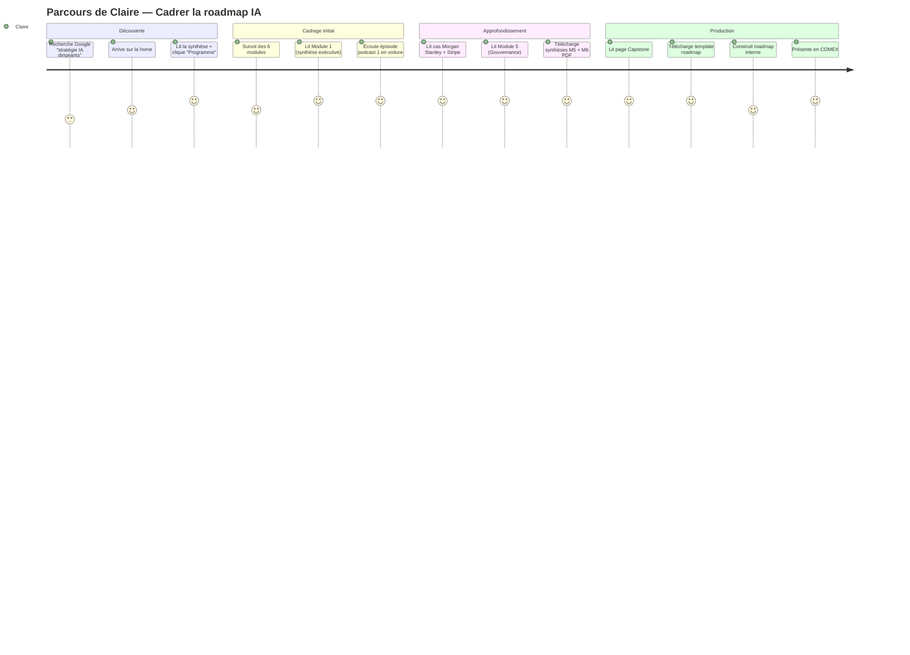
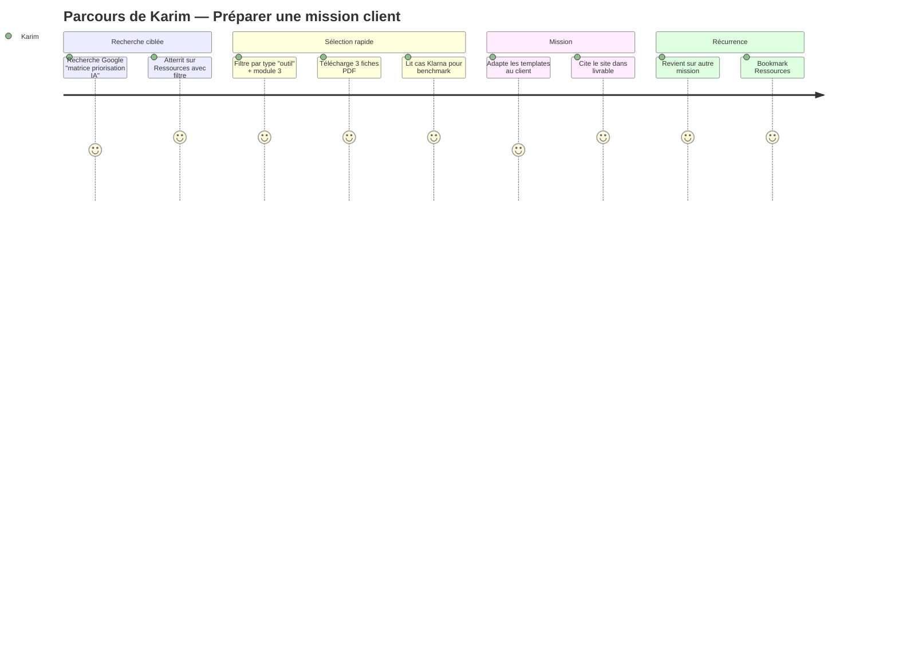
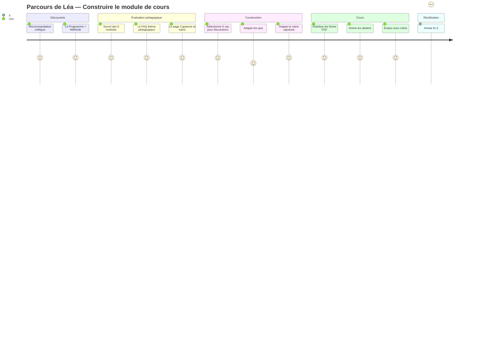
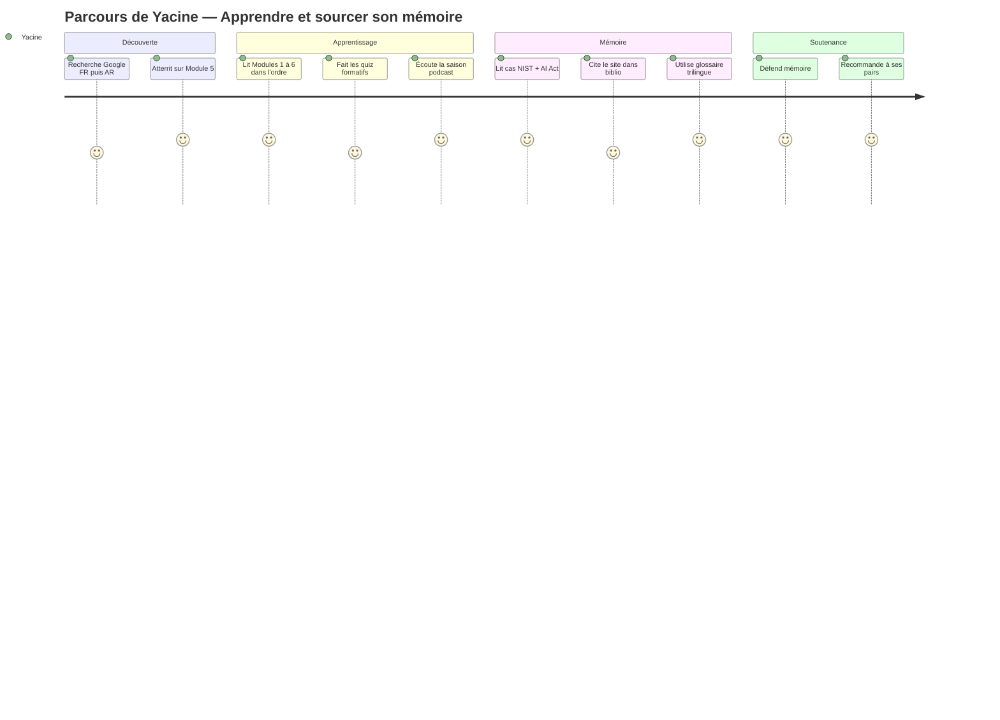

# Parcours utilisateurs — AI Strategy

> **4 user journeys** principaux décrivant la traversée du site par chacun des personas, avec les **points de friction**, les **moments de vérité** et les **opportunités d'optimisation**.

| Métadonnée | Valeur |
| :--- | :--- |
| **Version** | 1.0 |
| **Phase** | 2 — Architecture et design system |
| **Statut** | Ratifié |

---

## 1. Vue d'ensemble des 4 parcours

| # | Persona | Intention | Durée | Issue souhaitée |
| :---: | :--- | :--- | :--- | :--- |
| J1 | **Claire — COO** | Cadrer une roadmap IA en 6 mois | 3-4 mois cumulés | Présentation COMEX validée |
| J2 | **Karim — Consultant** | Préparer une mission client en 4 semaines | 1-2 semaines actives | Livrables clients structurés |
| J3 | **Léa — Enseignante** | Construire un module de cours MBA | 2-4 semaines de prep | Syllabus + supports + évaluation |
| J4 | **Yacine — Étudiant** | Apprendre + sourcer son mémoire | 3-4 mois | Mémoire défendu |

---

## 2. Légende des étapes

```
🔍 = découverte du site
📖 = lecture / apprentissage
⬇️  = téléchargement
🎧 = média audio
✏️  = production / activité
✅ = livrable accompli
⚠️ = point de friction potentiel
💡 = moment de vérité (rétention ou abandon)
```

---

## 3. J1 — Le parcours de Claire (COO)

### 3.1 Diagramme



### 3.2 Étapes détaillées

| Phase | Étape | Action | Page(s) du site | Livrable |
| :--- | :--- | :--- | :--- | :--- |
| **Découverte (S1)** | 🔍 | Recherche Google « comment cadrer une stratégie IA en entreprise » | (Hors site) | — |
|  | 🔍 | Arrive sur `/{lang}/` via résultat organique | Home | Première impression |
|  | 📖 | Lit le hero + bandeau de preuves + carte audience « Dirigeants » | Home | Décision de continuer |
|  | 📖 | Clique « Découvrir le programme » | `/programme/` | Compréhension du scope |
| **Cadrage (S2-3)** | 📖 | Survol du tableau des 6 modules | `/programme/` | Identification des modules clés |
|  | 📖 | Lit Module 1 (synthèse exécutive uniquement) | `/modules/01-introduction-ia/` | Vocabulaire de base |
|  | 🎧 | Écoute podcast E1 en voiture | `/saison-01/episode-01/` | Familiarisation auditive |
| **Approfondissement (M1-2)** | 📖 | Lit étude de cas Morgan Stanley | `/cas/morgan-stanley-genai/` | Comparable sectoriel |
|  | 📖 | Lit étude de cas Stripe Radar | `/cas/stripe-radar-ml/` | Compréhension ML pratique |
|  | 📖 | Lit Module 5 (Gouvernance) | `/modules/05-ia-societe/` | Cadrage gouvernance |
|  | ⬇️ | Télécharge synthèses M5 + M6 | `/ressources/fiches/` | Lecture offline |
| **Production (M3-4)** | 📖 | Lit page Capstone | `/capstone/` | Structure du livrable |
|  | ⬇️ | Télécharge template roadmap PDF | `/capstone/` | Squelette de travail |
|  | ⬇️ | Télécharge checklist exécutive | `/capstone/` | Point de contrôle COMEX |
|  | ✏️ | Adapte le template à son organisation | (Hors site) | Roadmap interne v1 |
| **Aboutissement (M4-6)** | ✅ | Présente la roadmap en COMEX | (Hors site) | Décision validée |

### 3.3 Points de friction identifiés

| ⚠️ Friction | Mitigation |
| :--- | :--- |
| Hero qui paraîtrait trop technique | Surtitre + lead très accessibles, pas de jargon en hero |
| Synthèses exécutives noyées dans les pages module | Composant `<ExecutiveSummary />` distinct, ancrable directement (`#synthese-executive`) |
| Hésitation à télécharger sans inscription | Politique « pas d'inscription » mise en avant + licence claire |
| Doute sur la légitimité (« est-ce un cours MIT ? ») | `<IndependenceNotice />` visible + lien vers FAQ thème 2 |

### 3.4 Moments de vérité

| 💡 Moment | Réussite si… | Échec si… |
| :--- | :--- | :--- |
| Après le hero | Claire pense « ce site sert mon problème » | Claire quitte la home (taux de rebond > 60 %) |
| Première lecture de module | Claire trouve la synthèse exécutive immédiatement | Claire abandonne avant la fin du module 1 |
| Téléchargement template capstone | Claire utilise le template pour sa roadmap | Claire passe à un autre site / un consultant |

---

## 4. J2 — Le parcours de Karim (Consultant)

### 4.1 Diagramme



### 4.2 Étapes détaillées (mission type)

| Phase | Étape | Action | Page(s) du site | Livrable |
| :--- | :--- | :--- | :--- | :--- |
| **Sourcing initial** | 🔍 | Recherche Google « matrice priorisation cas usage IA » | (Hors site) | — |
|  | 🔍 | Atterrit sur `/{lang}/ressources/` filtré | Ressources | Liste de templates |
| **Sélection** | 📖 | Applique filtres : type=`outil`, module=`module-3` | Ressources | 6 résultats pertinents |
|  | ⬇️ | Télécharge 3 fiches PDF (matrice, canvas, charter) | Fiches | Templates en local |
|  | 📖 | Lit étude de cas Klarna AI Assistant pour benchmark | `/cas/klarna-ai-assistant/` | Comparable client |
| **Préparation** | 📖 | Survol Module 3 (synthèse + concepts) | `/modules/03-ia-generative/` | Vocabulaire affûté |
|  | 📖 | Lit FAQ thème « Usage en mission de conseil » | `/faq/#mission-conseil` | Confirmation licence |
|  | 📖 | Lit page Méthode (hiérarchie sources) | `/methode/` | Argument de crédibilité |
| **Mission active** | ✏️ | Adapte les templates au contexte client | (Hors site) | Slides + matrices client |
|  | 📝 | Cite le site dans livrable client (CC BY-NC-SA) | (Hors site) | Citation propre |
|  | ✅ | Mission livrée | (Hors site) | Client satisfait |
| **Récurrence** | 🔁 | Revient pour une autre mission, autre secteur | Ressources | Réutilisation |
|  | ⭐ | Met en favori la page Ressources et 2-3 cas-clés | Browser | Capital outils personnel |

### 4.3 Friction et moments de vérité

| ⚠️ Friction | Mitigation |
| :--- | :--- |
| Filtres lents ou imprécis | Filtres state-driven URL + indexation côté client (Phase 5) |
| Doute sur usage commercial | FAQ thème licences explicite + lien depuis chaque page Ressources |
| Templates non éditables (PDF figés) | Format PDF interactif + version Markdown sur GitHub |
| Pas de version arabe d'un template | Stratégie de traduction dans Phase 7 ; version EN comme repli |

| 💡 Moment | Réussite si… |
| :--- | :--- |
| Téléchargement de la première fiche | Karim revient dans les 7 jours pour une autre |
| Citation du site dans son livrable | Karim partage le lien à 1-2 collègues |

---

## 5. J3 — Le parcours de Léa (Enseignante MBA)

### 5.1 Diagramme



### 5.2 Étapes détaillées (cycle annuel)

| Phase | Étape | Action | Livrable de Léa |
| :--- | :--- | :--- | :--- |
| **Découverte (juin)** | 🔍 | Recommandation collègue ou lien LinkedIn | — |
|  | 📖 | Lit Programme + Méthode pour évaluer la rigueur | Pré-décision |
| **Évaluation pédagogique (juin-juillet)** | 📖 | Lit FAQ thème « usage pédagogique » | Confirme licence |
|  | 📖 | Lit page Capstone + rubric | Évalue dispositif |
|  | 📖 | Survol des 6 modules pour cohérence avec son cours | Décision d'adoption |
| **Construction (juillet-août)** | 📖 | Sélectionne 6 cas pour ateliers de discussion | Plan ateliers |
|  | ✏️ | Adapte les quiz aux objectifs de son cours | Quiz internes |
|  | ✏️ | Adapte la rubric capstone à son contexte | Grille évaluation |
|  | ⬇️ | Télécharge glossaire complet, fiches concepts, quiz imprimables | Supports |
| **Cours (sept-déc)** | ⬇️ | Distribue les fiches PDF en début de séance | Supports apprenants |
|  | ✏️ | Anime ateliers cas en utilisant les questions de discussion | Pédagogie active |
|  | ✅ | Évalue les capstones avec la rubric adaptée | Notes finales |
| **Réutilisation (sept N+1)** | 🔁 | Revient vérifier les nouveautés | Mise à jour cours |

### 5.3 Friction et moments de vérité

| ⚠️ Friction | Mitigation |
| :--- | :--- |
| Doute académique sur la qualité des sources | Hiérarchie des sources visible + page Méthode + références |
| Rubric trop spécifique à une organisation | Rubric générique + indication d'adaptation possible |
| Quiz inadapté au niveau MBA | Niveaux taxonomie (`level-applicable`, `level-advanced`) explicites |
| Glossaire incomplet ou imprécis | Sources sur chaque définition + procédure de signalement |

| 💡 Moment | Réussite si… |
| :--- | :--- |
| Première lecture de la page Capstone | Léa décide d'adopter le dispositif |
| Premier cours utilisant les fiches | Les apprenants donnent un feedback positif |
| Année N+1 | Léa adopte le site comme référence durable |

---

## 6. J4 — Le parcours de Yacine (Étudiant Master SI)

### 6.1 Diagramme



### 6.2 Étapes détaillées (semestre)

| Phase | Étape | Action | Livrable |
| :--- | :--- | :--- | :--- |
| **Découverte (M-1)** | 🔍 | Recherche Google FR « gouvernance IA banque » puis bascule AR | — |
|  | 📖 | Atterrit sur Module 5 (gouvernance) | Compréhension initiale |
| **Apprentissage (M0-2)** | 📖 | Lit Modules 1 à 6 dans l'ordre | Maîtrise concepts |
|  | ✏️ | Fait les 6 quiz formatifs + capstone diagnostic | Auto-évaluation |
|  | 🎧 | Écoute la saison 1 du podcast en révision | Imprégnation |
| **Production mémoire (M2-4)** | 📖 | Lit études de cas NIST AI RMF, OCDE × AI Act | Sources réglementaires |
|  | 📝 | Cite le site dans bibliographie | Référence académique |
|  | 📖 | Bascule en arabe pour entretiens terrain bancaires | Vocabulaire AR |
|  | ⬇️ | Télécharge glossaire trilingue | Outil entretiens |
| **Soutenance (M5)** | ✅ | Défend mémoire devant jury | Diplôme M2 |
|  | 📢 | Recommande le site à 2-3 camarades | Diffusion |

### 6.3 Friction et moments de vérité

| ⚠️ Friction | Mitigation |
| :--- | :--- |
| Bascule FR ↔ AR difficile | Sélecteur de langue **persistant** qui conserve l'URL (cf. ADR-006) |
| Citation académique fastidieuse | Bloc « citer cette page » sur chaque module (à intégrer dans la Phase 4) |
| Glossaire arabe imprécis | Travail de relecture par locuteur natif Phase 7 |
| Quiz trop superficiels pour son niveau | Niveau `level-applicable` par défaut + niveau `level-advanced` disponible |

| 💡 Moment | Réussite si… |
| :--- | :--- |
| Première lecture en arabe | Yacine perçoit la parité éditoriale FR/AR |
| Citation dans le mémoire | Le jury valide la qualité de la source |
| Recommandation à ses pairs | Croissance organique dans la communauté étudiante MENA |

---

## 7. Synthèse — Implications pour le site

### 7.1 Composants critiques transversaux

| Composant | Justification cross-personas |
| :--- | :--- |
| `<TableOfContents />` sticky | Tous les personas naviguent dans des pages module longues |
| `<ExecutiveSummary />` distinct | Claire surtout, mais aussi accès rapide pour les autres |
| `<SourceTag />` visible | Léa et Yacine pour citation, Claire pour audit, Karim pour client |
| `<LanguageSwitcher />` persistant | Karim et Yacine surtout, mais cohérent pour tous |
| `<DownloadCard />` | Tous les personas téléchargent — UX rapide critique |
| `<IndependenceNotice />` | Rassure tous les personas, indispensable pour Léa et Yacine |

### 7.2 Stratégies de rétention

| Persona | Stratégie de rétention |
| :--- | :--- |
| Claire | Saison podcast longue (3h30+) → engagement asynchrone répété |
| Karim | Bibliothèque de fiches PDF en croissance → bookmark + retour fréquent |
| Léa | Cycle annuel + nouveautés signalées dans CHANGELOG visible |
| Yacine | Multilinguisme + glossaire de qualité → outil de travail durable |

### 7.3 Métriques de succès parcours par parcours

| Parcours | Métrique principale |
| :--- | :--- |
| J1 — Claire | Téléchargement template capstone + temps passé sur Modules 5/6 |
| J2 — Karim | Téléchargements de templates + retours dans le mois |
| J3 — Léa | Téléchargement rubric + retours en septembre N+1 |
| J4 — Yacine | Sessions longues (>30 min) + bascules linguistiques |

⚠️ Ces métriques sont **indicatives**. Leur instrumentation effective (analytics privacy-friendly) sera décidée en Phase 7.

---

## 📎 Documents associés

- [Personas](./personas.md)
- [Sitemap](../architecture/sitemap.md)
- [Gabarits de pages](../architecture/gabarits/)
